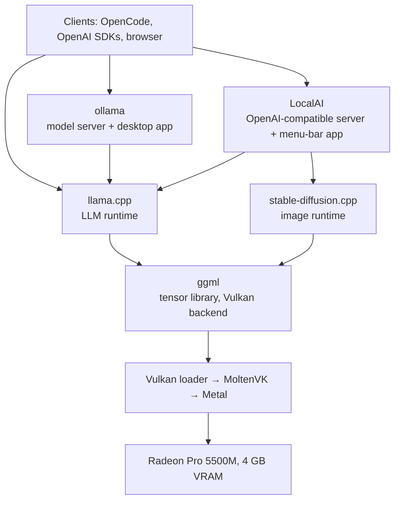

# Local AI on a 2019 MacBook Pro (Radeon Pro 5500M, 4 GB)

Running local LLMs and image generation on a 2019 Intel MacBook Pro, with the model resident in the discrete AMD GPU. Five tools — **ggml**, **llama.cpp**, **stable-diffusion.cpp**, **ollama**, **LocalAI** — each with a fork carrying the fixes and build settings this hardware needs. This page is the overview; each tool has its own guide with build, run and verification steps.

> **Test machine:** MacBook Pro 16" (2019) · Intel Core i9 · AMD Radeon Pro 5500M, 4 GB ([RDNA1](hardware.md#rdna-generations)) · Intel UHD 630 (not used) · macOS 14.8.2 · MoltenVK 1.4.2

## Contents

- [Why this repository exists](#why-this-repository-exists)
- [The stack](#the-stack)
- [Which tool to use](#which-tool-to-use)
- [Quick start: LocalAI and OpenCode](#quick-start-localai-and-opencode)
- [Shared setup](#shared-setup)
- [Known issues](#known-issues)
- [Hardware limits](#hardware-limits)
- [Models that fit in 4 GB](#models-that-fit-in-4-gb)
- [Measuring performance](#measuring-performance)
- [Repository layout](#repository-layout)

## Why this repository exists

Out of the box this GPU is unusable for AI work:

- **Metal is the wrong backend.** It assumes Apple Silicon's unified memory; on a discrete GPU it copies weights across PCIe every token — about 0.8 tok/s for a 4B LLM. Image generation never finishes, because the macOS GPU watchdog kills the command buffer.
- **Official builds ship no alternative.** Upstream ollama for macOS has no Vulkan runner, so the Radeon is ignored ([ollama#13127](https://github.com/ollama/ollama/issues/13127)); LocalAI's macOS build targets Apple Silicon.

What works is ggml's **[Vulkan](glossary.md#g-vulkan)** backend on **[MoltenVK](glossary.md#g-moltenvk)**, which implements Vulkan over Metal. Weights stay in the card's 4 GB of VRAM and a 3–4B model generates at 30–58 tok/s.

MoltenVK is not a complete Vulkan driver. Several gaps make GPU kernels return wrong results without raising an error — fluent gibberish, [NaN](glossary.md#g-nan), or images of pure noise — so the guides show how to verify a build is correct, not merely running.

## The stack



| Tool | Layer | What it gives you | Changes on the fork | Guide |
|---|---|---|---|---|
| **ggml** | Tensor library | GPU kernels, and `test-backend-ops` for checking each GPU operation against the CPU | 9 Vulkan commits | [ggml.md](ggml.md) |
| **llama.cpp** | LLM runtime | `llama-cli`, the OpenAI-compatible `llama-server`, and `llama-bench` | The ggml fixes plus diagnostic switches (10 commits) | [llama.cpp.md](llama.cpp.md) |
| **stable-diffusion.cpp** | Image runtime | Text-to-image CLI and server | None; build and run flags only | [stable-diffusion.cpp.md](stable-diffusion.cpp.md) |
| **ollama** | Model server | `ollama pull` / `run`, the model library, a desktop app | 5 patches, plus the llama.cpp fixes | [ollama.md](ollama.md) |
| **LocalAI** | Model server | One OpenAI-compatible API for text and images, a menu-bar app | None; build steps, wrapper scripts and an app bundle | [localai.md](localai.md) |

### How the forks relate

- **Fixes start in ggml.** It holds the GPU code, and `test-backend-ops` is the only tool that pins a wrong result to a specific shader.
- **llama.cpp** vendors a synced copy of ggml, plus diagnostic environment switches.
- **ollama and LocalAI** pin their own llama.cpp commits and cannot build from the branch tip; their guides cherry-pick the [ten commits](llama.cpp.md#changes-on-this-branch) onto that pin.
- **stable-diffusion.cpp** vendors a separate ggml ([leejet/ggml](https://github.com/leejet/ggml)) with none of the fixes. It does not need them on MoltenVK 1.4.2; a run flag avoids its one defect.

Each fork has a `macbook-pro-2019-radeon-5500m-4gb` branch containing a `RUNBOOK-…md` file, and each is included in this repository as a git submodule (see [Repository layout](#repository-layout)).

## Which tool to use

| If you want to… | Use |
|---|---|
| Point a coding agent or any OpenAI-SDK app at a local model, with text and images from one endpoint | **LocalAI**. See the [quick start](#quick-start-localai-and-opencode) |
| Use the simplest `pull` and `run` workflow, a desktop chat app, or vision models | **ollama** |
| Compare models, tune flags, or benchmark | **llama.cpp** (`llama-bench`, `llama-server`) |
| Generate images from the command line | **stable-diffusion.cpp** |
| Investigate wrong output or develop a fix | **ggml** (`test-backend-ops`) |

If a model misbehaves in ollama or LocalAI, reproduce it in llama.cpp, then run `test-backend-ops` in ggml. Each step down rules out a layer.

## Quick start: LocalAI and OpenCode

Shortest path from nothing installed to a coding agent on the GPU. Details: [localai.md](localai.md#use-with-a-coding-agent).

**1. Build and install the menu-bar app.** No prebuilt download exists; build `LocalAI-M.dmg` per [localai.md](localai.md#build), then:

```bash
open dist/LocalAI-M.dmg                                        # drag "LocalAI M.app" to /Applications
xattr -dr com.apple.quarantine "/Applications/LocalAI M.app"   # required: the app is ad-hoc signed
open "/Applications/LocalAI M.app"
```

The app runs in the menu bar with no Dock icon and starts the server with the MoltenVK environment set. API and web UI: `http://127.0.0.1:8085`.

**2. Add a model.** Weights are not bundled. Symlink a GGUF into the models folder and add a profile; OpenCode's opening prompt alone is about 11,000 tokens, so the window must be sized for it.

```bash
M=~/Library/Application\ Support/LocalAI/models
ln -s /path/to/granite-4.0-h-micro-Q4_K_M.gguf "$M/"
cat > "$M/granite-coder.yaml" <<'EOF'
name: granite-coder
backend: llama-cpp
parameters:
  model: granite-4.0-h-micro-Q4_K_M.gguf
context_size: 16384
f16: true
gpu_layers: 99
flash_attention: "true"
cache_type_k: q4_0
cache_type_v: q4_0
EOF
```

Restart the server from the menu-bar icon.

**3. Point OpenCode at it** in `~/.config/opencode/opencode.json`. The model key must match `name:` in the YAML, and `limit.context` must match `context_size`.

```json
{
  "$schema": "https://opencode.ai/config.json",
  "provider": {
    "localai": {
      "npm": "@ai-sdk/openai-compatible",
      "name": "LocalAI (Radeon 5500M)",
      "options": { "baseURL": "http://127.0.0.1:8085/v1" },
      "models": {
        "granite-coder": {
          "name": "Granite-4.0-H-Micro (16K, q4_0 KV)",
          "limit": { "context": 16384, "output": 4096 }
        }
      }
    }
  }
}
```

```bash
opencode run -m localai/granite-coder "Reply with exactly the word: ready"
```

Expect a first turn of about 3 minutes, while the GPU prefills OpenCode's system prompt, then 10–25 seconds per turn. Keep the server resident. Load one model per server session: on a 4 GB card a second model makes large prompts return empty completions with no error.

## Shared setup

Every guide assumes this setup.

```bash
# Toolchain. Link against vulkan-loader, not libMoltenVK directly, so the driver can be
# chosen at runtime. glslang, shaderc and spirv-headers compile ggml's shaders.
brew install cmake libomp \
  vulkan-headers vulkan-loader molten-vk glslang shaderc spirv-headers

brew list --versions molten-vk      # must be 1.4.2 or later

# Runtime environment: use MoltenVK as the Vulkan driver, and expose only the Radeon.
export VK_ICD_FILENAMES="$(brew --prefix)/opt/molten-vk/etc/vulkan/icd.d/MoltenVK_icd.json"
export DYLD_LIBRARY_PATH="$(brew --prefix)/opt/molten-vk/lib:$(brew --prefix)/opt/vulkan-loader/lib:$DYLD_LIBRARY_PATH"
export GGML_VK_VISIBLE_DEVICES=0
```

**Check the device list before anything else.** Unset `GGML_VK_VISIBLE_DEVICES` once and start any ggml tool. The first line printed must be the Radeon:

```
ggml_vulkan: 0 = AMD Radeon Pro 5500M (MoltenVK) | uma: 0 | fp16: 1 | bf16: 0 | fp4: 0 | warp size: 32 | shared memory: 65536 | int dot: 0 | matrix cores: none
ggml_vulkan: 1 = Intel(R) UHD Graphics 630 (MoltenVK) | uma: 1 | fp16: 1 | bf16: 0 | fp4: 0 | warp size: 32 | shared memory: 65536 | int dot: 0 | matrix cores: none
```

- `warp size: 32` confirms MoltenVK 1.4.2 or later. Older versions print `64`, which is the cause of most wrong-output bugs.
- If the Radeon is not device `0`, set `GGML_VK_VISIBLE_DEVICES` to its index. Never run on the Intel GPU.
- `int dot: 0` is expected even when the integer-dot optimisation is active. See [Reading the capability line](hardware.md#reading-the-capability-line).

## Known issues

Each produces slow or wrong output rather than an error. All are fixed or worked around on the forks; on another build, use this table to identify the symptom.

| Issue | Symptom | Cause | Fix |
|---|---|---|---|
| <a name="ki-metal"></a>**Metal backend compiled in** | About 0.8 tok/s, or a GPU watchdog timeout (`kIOAccelCommandBufferCallbackErrorTimeout`) during image generation | ggml enables Metal on macOS by default, even when the wrapping project's own flag (`SD_METAL=OFF`, `BUILD_TYPE=vulkan`) says otherwise. Metal then claims device 0. | Always pass `-DGGML_METAL=OFF` explicitly. Confirm with `otool -L <binary> \| grep -i metal`, which should print nothing. |
| <a name="ki-wrong-device"></a>**Wrong GPU selected** | Gibberish output, or allocation failures | The Intel GPU reports 32 GiB of shared memory against the Radeon's 4 GiB, so "pick the largest GPU" logic chooses it. ollama also passed a device index that was off by one. | Set `GGML_VK_VISIBLE_DEVICES=0`. The ollama fork patches the index. |
| <a name="ki-subgroup-size"></a>**MoltenVK misreports subgroup size** | Gibberish output, and NaN from hybrid models (Mamba-2, Gated DeltaNet) on the GPU but not on the CPU | MoltenVK 1.4.1 and earlier report a [subgroup](glossary.md#g-subgroup) size of 64, but Metal runs 32. Every shader that relies on subgroups computes over the wrong range. | Upgrade to MoltenVK 1.4.2 or later. The forks also carry shader fixes, which apply automatically on older drivers. |
| <a name="ki-flash-attention"></a>**Flash attention runs on the CPU** | `-fa on` is about 3.5× slower, and a quantized KV cache is too slow to use | ggml's Vulkan flash-attention path requires subgroup operations that were disabled on AMD Macs, so attention silently fell back to the CPU | The forks run flash attention on the GPU. Generation goes from 10.2 to 40.4 tok/s, and a q4_0 KV cache costs only about 4%. |
| <a name="ki-q8-0"></a>**q8_0 wrong on two GPU paths** | Wrong results with a q8_0 KV cache under flash attention (337 `test-backend-ops` failures) | MoltenVK mistranslates one shader construct that only these q8_0 paths use | The forks route q8_0 to correct paths. On other builds, use an f16 or q4_0 KV cache. |
| <a name="ki-diffusion-noise"></a>**Images are colourful noise** | Every generated image is full-frame noise | The default GPU convolution (im2col) is numerically wrong on this stack. The root cause has not been found. | Pass `--diffusion-conv-direct`, which is also about 3× faster |
| <a name="ki-vram"></a>**Out of VRAM** | Sudden slowdowns, failure at the last step of image generation, or empty completions from a second model | 4 GB is the hard limit. About 4278 MB is usable. | Quantize, size the context from the [model tables](models.md), load one model per session, and run the VAE on the CPU for SDXL |

MoltenVK 1.4.2 is the single most valuable upgrade: with it, clean upstream ggml passes `MUL_MAT`, `SSM_SCAN` and `GATED_DELTA_NET` on the Radeon unpatched. The forks remain necessary for GPU flash attention, the q8_0 guards and the integer-dot speed-up.

> **Keep the Intel GPU pinned out.** The forks disable their subgroup workarounds from MoltenVK 1.4.2 on every device. That is correct for the Radeon and wrong for the Intel UHD 630, which still fails `SSM_SCAN` and `GATED_DELTA_NET`. See [ggml.md](ggml.md#troubleshooting).

## Hardware limits

Silicon limits, not software ones:

- **No unified memory** (`uma: 0`): every weight must fit in 4 GB of VRAM, and advice written for Apple Silicon does not transfer.
- **No bfloat16** (`bf16: 0`): bf16 weights produce NaN. Use fp16 or a quantized GGUF.
- **No matrix cores**: no fast kernel for stable-diffusion.cpp's `--diffusion-fa`, so leave it off.
- **The Intel GPU is slower than the CPU** at every size tested, and is excluded everywhere.
- **Device loss (`vk::DeviceLostError`) after hours of continuous GPU work.** Cause undetermined; leave gaps between jobs and supervise long-lived servers.

What each field of the ggml capability line means, and where this GPU sits among AMD's generations: [hardware.md](hardware.md).

## Models that fit in 4 GB

All [Q4_K_M](glossary.md#g-quant), running fully on the GPU:

| Use case | Model | Why |
|---|---|---|
| General chat and tool calling | **Qwen3-4B-Instruct-2507** | Best tool-calling score (BFCL 0.88). 40 tok/s. Context is tight: about 10K tokens with f16 KV, 35K with q4_0. |
| Maths and reasoning | **Qwen3.5-4B** | Best on MATH-500 (0.81) and GPQA Diamond (0.56). 34 tok/s. |
| Broad knowledge, quality first | **Gemma-4-E4B** | Best MMLU-Pro here (0.54) and second on GPQA (0.49). The slowest in the set at 32 tok/s, and 3.2 GB. |
| Best capability per gigabyte | **Gemma-4-E2B** | Second on instruction-following and GPQA, 0.84 tool calling, fastest prefill (149 pp512) — in 1.65 GB. |
| Agent loops and long context | **Granite-4.0-H-Micro** | Most reliable tool calling (24/24 on the custom set, BFCL 0.86). Its Mamba-2 hybrid design fits its entire 128K trained context with f16 KV, with VRAM to spare. |
| Speed and small footprint | **LFM2.5-2.6B** | Fastest (58 tok/s) and smallest (1.84 GB). Fits its full 128K context. |
| Vision | **Qwen3-VL-4B** in ollama | 32 tok/s with `OLLAMA_IMAGE_MIN_TOKENS=512` |
| Images | **SD-Turbo** at q8_0 | 1.7 s per step in 2 GB. Use SDXL-Turbo for more photorealism. |

Notes:

- **Architecture, not parameter count, sets the context ceiling.** Hybrid models keep few attention layers, so their KV cache grows 5–18× more slowly than a dense model's.
- **A quantized KV cache costs about 4%** with flash attention on the GPU, and cuts the cache from 32 to 9 KiB per token.
- **Phi-4-mini and SmolLM3-3B emit no parseable `tool_calls`** on this stack, so they are unsuitable for tool-driven loops.
- **The Gemma-4 models follow a requested answer format inconsistently** — near-perfect on `The answer is (X)`, under a third of the time on LaTeX `\boxed{}`. Test the shape your pipeline parses.

The full speed table, context ceilings, capability scores and unattended-use advice are in [models.md](models.md).

## Measuring performance

Benchmark numbers are misleading unless machine state is controlled: the same binary, model and flags measured 10.5, 24.9 and 33.9 tok/s across three sessions. The dominant factor is the GPU clock, which idles at 10 MHz and is not spun up by a short benchmark.

- Warm the GPU with a discarded run before measuring.
- Run one configuration per process, alternating the order of configurations compared.
- Report every repetition, not just the mean, and do not compare tables produced on different days.
- For real-world figures, measure a running server: over the API, LocalAI repeats within 5%.

The full method, and how each benchmark in this repository was run: [benchmarking.md](benchmarking.md).

## Repository layout

The five forks are submodules, each pinned to its `macbook-pro-2019-radeon-5500m-4gb` branch.

```bash
git clone --recurse-submodules https://github.com/maximosipov/macbook-pro-2019-radeon-5500m-4gb.git
git submodule update --init ggml       # or fetch just one submodule (llama.cpp is about 540 MB)
git submodule update --remote ggml     # move a submodule to its branch tip
```

| Document | Contents |
|---|---|
| [ggml.md](ggml.md) · [llama.cpp.md](llama.cpp.md) · [stable-diffusion.cpp.md](stable-diffusion.cpp.md) · [ollama.md](ollama.md) · [localai.md](localai.md) | Tool guides: build, run, verify, performance and troubleshooting |
| [models.md](models.md) | Model speed, VRAM and context ceilings, capability scores, and recommendations |
| [localai-models/](localai-models/) | Ready-to-use LocalAI model YAML files for the recommended models |
| [benchmarking.md](benchmarking.md) | How to measure this machine, and how each benchmark was run |
| [hardware.md](hardware.md) | The ggml capability line, and AMD GPU generations |
| [glossary.md](glossary.md) | Definitions of every term used, with references |
| `<fork>/RUNBOOK-macbook-pro-2019-radeon-5500m-4gb.md` | The runbook kept on each fork's branch |
