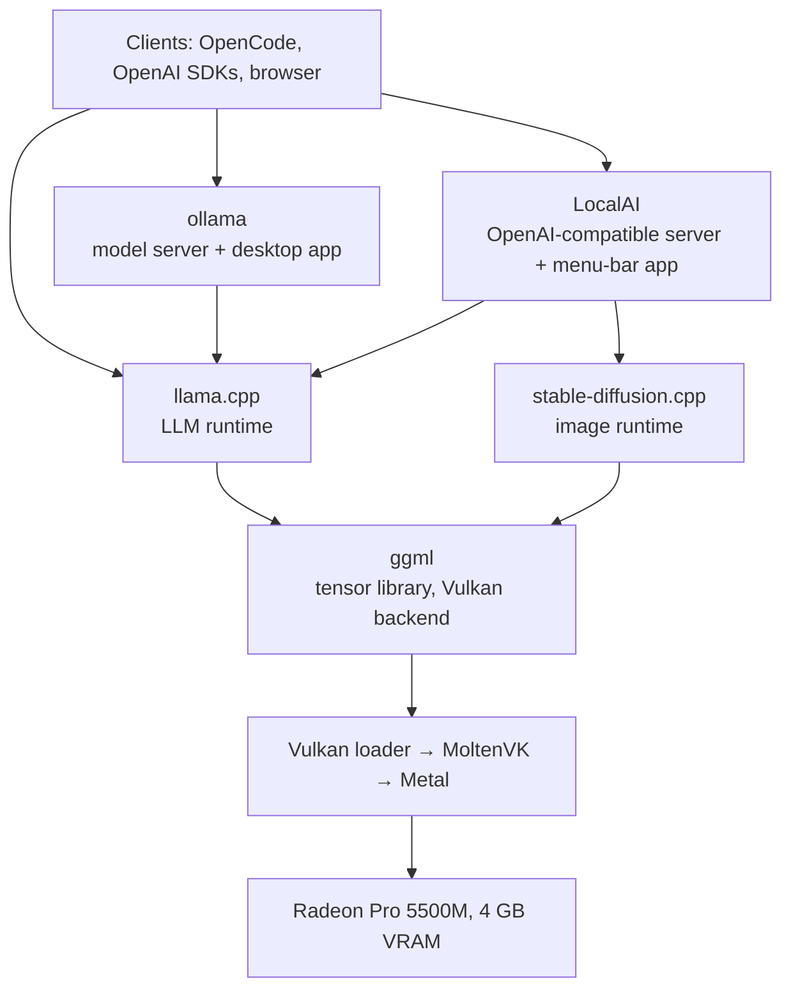

# Local AI on a 2019 MacBook Pro (Radeon Pro 5500M, 4 GB)

This repository shows how to run local LLMs and image generation on a 2019 Intel MacBook Pro, with the model loaded into the discrete AMD GPU. It covers five open-source tools: **ggml**, **llama.cpp**, **stable-diffusion.cpp**, **ollama** and **LocalAI**. Each has a fork with the fixes and build settings this hardware needs.

This page is the overview. Each tool has its own guide with build, run and verification steps.

> **Test machine:** MacBook Pro 16" (2019) · Intel Core i9 · AMD Radeon Pro 5500M, 4 GB ([RDNA1](hardware.md#rdna-generations)) · Intel UHD 630 (not used) · macOS 14.8.2 · MoltenVK 1.4.2
>
> Every number in this repository was measured on this one machine.

## Contents

- [Why this repository exists](#why-this-repository-exists)
- [The stack](#the-stack)
- [Which tool to use](#which-tool-to-use)
- [Quick start: LocalAI and OpenCode](#quick-start-localai-and-opencode)
- [Shared setup](#shared-setup)
- [Known issues](#known-issues)
- [Hardware limits](#hardware-limits)
- [Models that fit in 4 GB](#models-that-fit-in-4-gb)
- [Measuring performance](#measuring-performance)
- [Repository layout](#repository-layout)

## Why this repository exists

Out of the box, the GPU in this laptop is effectively unusable for AI work:

- **Metal is the wrong backend.** ggml's Metal backend is designed for Apple Silicon's unified memory. On a discrete GPU it copies weights across PCIe on every token, which gives about 0.8 tok/s for a 4B LLM. Image generation never finishes at all, because macOS's GPU watchdog kills the long-running command buffer.
- **Official builds don't include the alternative.** Upstream ollama for macOS ships no Vulkan runner, so the Radeon is ignored ([ollama#13127](https://github.com/ollama/ollama/issues/13127)). LocalAI's macOS build targets Apple Silicon.

What works is ggml's **[Vulkan](glossary.md#g-vulkan)** backend running on **[MoltenVK](glossary.md#g-moltenvk)**, a translation layer that implements Vulkan on top of Metal. The weights stay in the card's 4 GB of VRAM, and a 3–4B model generates at 30–58 tok/s.

MoltenVK is not a perfect Vulkan driver, though. Several of its gaps make GPU kernels return **wrong results without raising an error**: fluent-looking gibberish, [NaN](glossary.md#g-nan) values, or images of pure noise. The forks here fix or work around those gaps. The guides also show how to check that a build is *correct*, not just that it runs.

## The stack



| Tool | Layer | What it gives you | Changes on the fork | Guide |
|---|---|---|---|---|
| **ggml** | Tensor library | GPU kernels, and `test-backend-ops` for checking each GPU operation against the CPU | 9 Vulkan commits | [ggml.md](ggml.md) |
| **llama.cpp** | LLM runtime | `llama-cli`, the OpenAI-compatible `llama-server`, and `llama-bench` | The ggml fixes plus diagnostic switches (10 commits) | [llama.cpp.md](llama.cpp.md) |
| **stable-diffusion.cpp** | Image runtime | Text-to-image CLI and server | None; build and run flags only | [stable-diffusion.cpp.md](stable-diffusion.cpp.md) |
| **ollama** | Model server | `ollama pull` / `run`, the model library, a desktop app | 5 patches, plus the llama.cpp fixes | [ollama.md](ollama.md) |
| **LocalAI** | Model server | One OpenAI-compatible API for text and images, a menu-bar app | None; build steps, wrapper scripts and an app bundle | [localai.md](localai.md) |

### How the forks relate

- **Fixes start in ggml.** It holds all the GPU code, and its `test-backend-ops` tool is the only one that can pin a wrong result on a specific shader.
- **llama.cpp** vendors a synced copy of ggml. Its branch carries the same fixes, plus environment-variable switches used for diagnosis.
- **ollama and LocalAI** each pin their own llama.cpp commit and can't build from the llama.cpp branch tip. Their guides cherry-pick the [ten llama.cpp commits](llama.cpp.md#changes-on-this-branch) onto that pin.
- **stable-diffusion.cpp** vendors a separate copy of ggml ([leejet/ggml](https://github.com/leejet/ggml)) and carries none of the fixes. It doesn't need them on MoltenVK 1.4.2, and a run flag avoids its one remaining defect.

Each fork has a `macbook-pro-2019-radeon-5500m-4gb` branch containing a `RUNBOOK-…md` file, and each is included in this repository as a git submodule (see [Repository layout](#repository-layout)).

## Which tool to use

| If you want to… | Use |
|---|---|
| Point a coding agent or any OpenAI-SDK app at a local model, with text and images from one endpoint | **LocalAI**. See the [quick start](#quick-start-localai-and-opencode) |
| Use the simplest `pull` and `run` workflow, a desktop chat app, or vision models | **ollama** |
| Compare models, tune flags, or benchmark | **llama.cpp** (`llama-bench`, `llama-server`) |
| Generate images from the command line | **stable-diffusion.cpp** |
| Investigate wrong output or develop a fix | **ggml** (`test-backend-ops`) |

If a model misbehaves in ollama or LocalAI, reproduce the problem in llama.cpp first, then run `test-backend-ops` in ggml. Each step down the stack rules out one layer.

## Quick start: LocalAI and OpenCode

This is the shortest path from nothing installed to a coding agent running on your own GPU. Full details are in [localai.md](localai.md#use-with-a-coding-agent).

**1. Build and install the menu-bar app.** No prebuilt download exists. Build `LocalAI-M.dmg` by following [localai.md](localai.md#build), then:

```bash
open dist/LocalAI-M.dmg                                        # drag "LocalAI M.app" to /Applications
xattr -dr com.apple.quarantine "/Applications/LocalAI M.app"   # required: the app is ad-hoc signed
open "/Applications/LocalAI M.app"
```

The app lives in the menu bar and has no Dock icon. It starts the server with the MoltenVK environment already set. The server's API and web UI are at `http://127.0.0.1:8085`.

**2. Add a model.** Weights aren't bundled with the app. Symlink a GGUF into the models folder and add a profile. The context window must be large enough for an agent: OpenCode's opening prompt alone is about 11,000 tokens.

```bash
M=~/Library/Application\ Support/LocalAI/models
ln -s /path/to/granite-4.0-h-micro-Q4_K_M.gguf "$M/"
cat > "$M/granite-coder.yaml" <<'EOF'
name: granite-coder
backend: llama-cpp
parameters:
  model: granite-4.0-h-micro-Q4_K_M.gguf
context_size: 16384
f16: true
gpu_layers: 99
flash_attention: "true"
cache_type_k: q4_0
cache_type_v: q4_0
EOF
```

Restart the server from the menu-bar icon.

**3. Point OpenCode at it.** Add this to `~/.config/opencode/opencode.json`. The model key must match `name:` in the YAML, and `limit.context` must match `context_size`.

```json
{
  "$schema": "https://opencode.ai/config.json",
  "provider": {
    "localai": {
      "npm": "@ai-sdk/openai-compatible",
      "name": "LocalAI (Radeon 5500M)",
      "options": { "baseURL": "http://127.0.0.1:8085/v1" },
      "models": {
        "granite-coder": {
          "name": "Granite-4.0-H-Micro (16K, q4_0 KV)",
          "limit": { "context": 16384, "output": 4096 }
        }
      }
    }
  }
}
```

```bash
opencode run -m localai/granite-coder "Reply with exactly the word: ready"
```

**What to expect:**

- **The first turn takes about 3 minutes**, because the GPU has to process OpenCode's whole system prompt. Later turns take 10–25 seconds. Keep the server running between sessions.
- **Load only one model per server session.** On a 4 GB card, a second model makes large prompts return empty completions with no error. If you switch models, quit and relaunch the app first.
- **Check the output.** This is a 3B-class model: it is quick enough to be pleasant, and wrong often enough that you should read everything it produces.

## Shared setup

Every guide assumes this setup.

```bash
# Toolchain. Link against vulkan-loader, not libMoltenVK directly, so the driver can be
# chosen at runtime. glslang, shaderc and spirv-headers compile ggml's shaders.
brew install cmake libomp \
  vulkan-headers vulkan-loader molten-vk glslang shaderc spirv-headers

brew list --versions molten-vk      # must be 1.4.2 or later

# Runtime environment: use MoltenVK as the Vulkan driver, and expose only the Radeon.
export VK_ICD_FILENAMES="$(brew --prefix)/opt/molten-vk/etc/vulkan/icd.d/MoltenVK_icd.json"
export DYLD_LIBRARY_PATH="$(brew --prefix)/opt/molten-vk/lib:$(brew --prefix)/opt/vulkan-loader/lib:$DYLD_LIBRARY_PATH"
export GGML_VK_VISIBLE_DEVICES=0
```

**Check the device list before anything else.** Unset `GGML_VK_VISIBLE_DEVICES` once and start any ggml tool. The first line printed must be the Radeon:

```
ggml_vulkan: 0 = AMD Radeon Pro 5500M (MoltenVK) | uma: 0 | fp16: 1 | bf16: 0 | fp4: 0 | warp size: 32 | shared memory: 65536 | int dot: 0 | matrix cores: none
ggml_vulkan: 1 = Intel(R) UHD Graphics 630 (MoltenVK) | uma: 1 | fp16: 1 | bf16: 0 | fp4: 0 | warp size: 32 | shared memory: 65536 | int dot: 0 | matrix cores: none
```

- `warp size: 32` confirms MoltenVK 1.4.2 or later. Older versions print `64`, which is the cause of most wrong-output bugs.
- If the Radeon is not device `0`, set `GGML_VK_VISIBLE_DEVICES` to its index. Never run on the Intel GPU.
- `int dot: 0` is expected even when the integer-dot optimisation is active. See [Reading the capability line](hardware.md#reading-the-capability-line).

## Known issues

These are the problems you will hit on this hardware. Each one produces slow or wrong output rather than an error message. All of them are fixed or worked around on the forks. If you are using another build, use this table to check what to look for.

| Issue | Symptom | Cause | Fix |
|---|---|---|---|
| <a name="ki-metal"></a>**Metal backend compiled in** | About 0.8 tok/s, or a GPU watchdog timeout (`kIOAccelCommandBufferCallbackErrorTimeout`) during image generation | ggml enables Metal on macOS by default, even when the wrapping project's own flag (`SD_METAL=OFF`, `BUILD_TYPE=vulkan`) says otherwise. Metal then claims device 0. | Always pass `-DGGML_METAL=OFF` explicitly. Confirm with `otool -L <binary> \| grep -i metal`, which should print nothing. |
| <a name="ki-wrong-device"></a>**Wrong GPU selected** | Gibberish output, or allocation failures | The Intel GPU reports 32 GiB of shared memory against the Radeon's 4 GiB, so "pick the largest GPU" logic chooses it. ollama also passed a device index that was off by one. | Set `GGML_VK_VISIBLE_DEVICES=0`. The ollama fork patches the index. |
| <a name="ki-subgroup-size"></a>**MoltenVK misreports subgroup size** | Gibberish output, and NaN from hybrid models (Mamba-2, Gated DeltaNet) on the GPU but not on the CPU | MoltenVK 1.4.1 and earlier report a [subgroup](glossary.md#g-subgroup) size of 64, but Metal runs 32. Every shader that relies on subgroups computes over the wrong range. | Upgrade to MoltenVK 1.4.2 or later. The forks also carry shader fixes, which apply automatically on older drivers. |
| <a name="ki-flash-attention"></a>**Flash attention runs on the CPU** | `-fa on` is about 3.5× slower, and a quantized KV cache is too slow to use | ggml's Vulkan flash-attention path requires subgroup operations that were disabled on AMD Macs, so attention silently fell back to the CPU | The forks run flash attention on the GPU. Generation goes from 10.2 to 40.4 tok/s, and a q4_0 KV cache costs only about 4%. |
| <a name="ki-q8-0"></a>**q8_0 wrong on two GPU paths** | Wrong results with a q8_0 KV cache under flash attention (337 `test-backend-ops` failures) | MoltenVK mistranslates one shader construct that only these q8_0 paths use | The forks route q8_0 to correct paths. On other builds, use an f16 or q4_0 KV cache. |
| <a name="ki-diffusion-noise"></a>**Images are colourful noise** | Every generated image is full-frame noise | The default GPU convolution (im2col) is numerically wrong on this stack. The root cause has not been found. | Pass `--diffusion-conv-direct`, which is also about 3× faster |
| <a name="ki-vram"></a>**Out of VRAM** | Sudden slowdowns, failure at the last step of image generation, or empty completions from a second model | 4 GB is the hard limit. About 4278 MB is usable. | Quantize, size the context from the [model tables](models.md), load one model per session, and run the VAE on the CPU for SDXL |

**MoltenVK 1.4.2 is the most valuable upgrade you can make.** The subgroup misreport caused the gibberish, the NaN in hybrid models, and, indirectly, the CPU fallback for flash attention. With 1.4.2, clean upstream ggml passes `MUL_MAT`, `SSM_SCAN` and `GATED_DELTA_NET` on the Radeon without any patches. The forks are still needed for GPU flash attention, the q8_0 guards and the integer-dot speed-up.

> **Keep the Intel GPU pinned out.** The forks turn their subgroup workarounds off for MoltenVK 1.4.2 and later on *every* device. That is correct for the Radeon and wrong for the Intel UHD 630, which still fails `SSM_SCAN` and `GATED_DELTA_NET` on 1.4.2. See [ggml.md](ggml.md#troubleshooting).

## Hardware limits

Some limits can't be fixed in software, because the silicon lacks the feature. Design around these:

- **No unified memory** (`uma: 0`). Every weight must fit in 4 GB of VRAM. Advice written for Apple Silicon doesn't transfer.
- **No bfloat16** (`bf16: 0`). bf16 weights produce NaN. Use fp16 or a quantized GGUF.
- **No matrix cores** (`matrix cores: none`). There is no fast kernel for stable-diffusion.cpp's `--diffusion-fa`, so leave it off.
- **The Intel GPU is slower than the CPU** at every model size tested. It's excluded everywhere.
- **The Radeon can lose the device (`vk::DeviceLostError`) after hours of back-to-back GPU work.** The cause is undetermined. Leave gaps between jobs, and run long-lived servers under a supervisor that restarts them.

What each field of the ggml capability line means, and where this GPU sits among AMD's generations: [hardware.md](hardware.md).

## Models that fit in 4 GB

Starting points, all quantized as [Q4_K_M](glossary.md#g-quant) and running fully on the GPU:

| Use case | Model | Why |
|---|---|---|
| General chat and tool calling | **Qwen3-4B-Instruct-2507** | Best tool-calling score (BFCL 0.88). 40 tok/s. Context is tight: about 10K tokens with f16 KV, 35K with q4_0. |
| Maths and reasoning | **Qwen3.5-4B** | Best on MATH-500 (0.81) and GPQA Diamond (0.56). 34 tok/s. |
| Agent loops and long context | **Granite-4.0-H-Micro** | Most reliable tool calling (24/24 on the custom set, BFCL 0.86). Its Mamba-2 hybrid design gives about 292K tokens of context with f16 KV. |
| Speed and small footprint | **LFM2.5-2.6B** | Fastest (58 tok/s) and smallest (1.84 GB). Fits its full 131K context. |
| Vision | **Qwen3-VL-4B** in ollama | 32 tok/s with `OLLAMA_IMAGE_MIN_TOKENS=512` |
| Images | **SD-Turbo** at q8_0 | 1.7 s per step in 2 GB. Use SDXL-Turbo for more photorealism. |

Three findings shape these choices:

- **Architecture, not parameter count, sets the context ceiling.** Hybrid models keep only a few attention layers, so their KV cache grows 5–18× more slowly than a dense model's.
- **A quantized KV cache is now nearly free.** With flash attention on the GPU, `-ctk q4_0 -ctv q4_0` costs about 4% in speed and cuts the cache from 32 to 9 KiB per token.
- **Phi-4-mini and SmolLM3-3B don't suit tool-driven loops on this stack.** They answer tool prompts in prose and emit no parseable `tool_calls`.

The full speed table, context ceilings, capability scores and unattended-use advice are in [models.md](models.md).

## Measuring performance

This laptop gives misleading benchmark numbers unless you control for its state. One binary, with the same model and flags, measured 10.5, 24.9 and 33.9 tok/s in three different sessions. The biggest factor is the GPU clock: the Radeon idles at 10 MHz, and a short benchmark doesn't spin it up.

- **Warm the GPU** with a discarded run before measuring.
- **Run one configuration per process,** and alternate the order of the configurations you compare.
- **Report every repetition,** not just the mean. Don't compare tables produced on different days.
- **For real-world numbers, measure a running server,** not a micro-benchmark. Over the API, LocalAI repeated within 5%.

The full method, and how each benchmark in this repository was run: [benchmarking.md](benchmarking.md).

## Repository layout

The five forks are submodules, each pinned to its `macbook-pro-2019-radeon-5500m-4gb` branch. A recursive clone gives you these docs and the exact source trees behind every measurement.

```bash
git clone --recurse-submodules https://github.com/maximosipov/macbook-pro-2019-radeon-5500m-4gb.git
git submodule update --init ggml       # or fetch just one submodule (llama.cpp is about 540 MB)
git submodule update --remote ggml     # move a submodule to its branch tip
```

| Document | Contents |
|---|---|
| [ggml.md](ggml.md) · [llama.cpp.md](llama.cpp.md) · [stable-diffusion.cpp.md](stable-diffusion.cpp.md) · [ollama.md](ollama.md) · [localai.md](localai.md) | Tool guides: build, run, verify, performance and troubleshooting |
| [models.md](models.md) | Model speed, VRAM and context ceilings, capability scores, and recommendations |
| [benchmarking.md](benchmarking.md) | How to measure this machine, and how each benchmark was run |
| [hardware.md](hardware.md) | The ggml capability line, and AMD GPU generations |
| [glossary.md](glossary.md) | Definitions of every term used, with references |
| `<fork>/RUNBOOK-macbook-pro-2019-radeon-5500m-4gb.md` | The runbook kept on each fork's branch |
