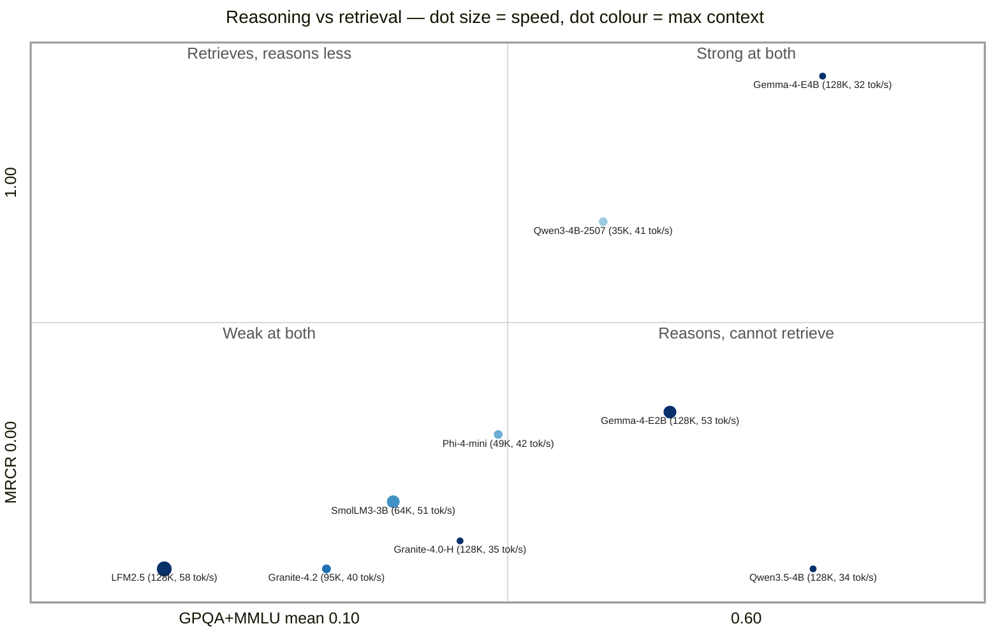

# Models for a 4 GB GPU

Which models fit, how fast they run, how much context they hold, and how capable they are. All measurements come from this machine; see [benchmarking.md](benchmarking.md) for the methods and their caveats.

- [At a glance](#at-a-glance)
- [Who makes these models](#who-makes-these-models)
- [Speed and fit](#speed-and-fit)
- [Context ceilings](#context-ceilings)
- [Capability scores](#capability-scores)
- [Long-context retrieval](#long-context-retrieval)
- [Choosing a model for unattended work](#choosing-a-model-for-unattended-work)
- [Image models](#image-models)

## At a glance

Two views of the same measurements: position on the axes that decide a choice, and per-benchmark ranking.

### Reasoning against retrieval

Four measurements per model:

| Encoding | Meaning |
|---|---|
| **Horizontal** | Knowledge and reasoning — mean of GPQA-Diamond and MMLU-Pro, 0.10 to 0.60 |
| **Vertical** | Long-context retrieval — MRCR at ~19K tokens, 0.00 to 1.00 |
| **Dot size** | Generation speed — smallest dot 32 tok/s, largest 58 |
| **Dot colour** | Largest context that fits on this card — pale blue 35K through deep navy 128K |

Labels repeat both as `(context, speed)`. Context maxima are the q4_0 figures from the [ceilings table](#context-ceilings); several are the model's trained limit rather than the card's.

Gemma-4-E4B and Qwen3.5-4B differ by 0.005 on reasoning and 2 tok/s, and by the full height of the chart on retrieval. Short-prompt capability does not predict long-context behaviour.

Gemma-4-E4B is alone in the top right and is the slowest decoder in the set. Gemma-4-E2B trades some retrieval for 53 tok/s and the smallest footprint (1.65 GB). LFM2.5 is the fastest model and the weakest on both other axes.

Context capacity cuts across both axes: five models hold their full 128K window, spread across all four quadrants, because the ceiling follows [KV geometry](#context-ceilings) rather than model quality. Only Qwen3-4B-2507 (35K) and Phi-4-mini (49K) are constrained, and both need a q4_0 cache for even that — at f16 they reach about 10K and 14K.

*The quadrant boundaries fall at reasoning 0.35 and MRCR 0.25. The retrieval axis is square-root scaled, because five of the nine models score within 0.04 of zero and would otherwise be one unreadable blob.*

### Ranking across every benchmark

```mermaid
block-beta
    columns 7
    h0["model"] h1["MATH-500"] h2["IFBench"] h3["MMLU-Pro"] h4["GPQA-D"] h5["BFCL"] h6["MRCR"]
    m0["Qwen3-4B-2507 · Alibaba"] c0_0["0.75"] c0_1["0.21"] c0_2["0.43"] c0_3["0.37"] c0_4["0.88"] c0_5["0.47"]
    m1["Qwen3.5-4B · Alibaba"] c1_0["0.81"] c1_1["0.26"] c1_2["0.46"] c1_3["0.56"] c1_4["0.75"] c1_5["0.00"]
    m2["Gemma-4-E2B · Google"] c2_0["0.29"] c2_1["0.24"] c2_2["0.43"] c2_3["0.44"] c2_4["0.84"] c2_5["0.11"]
    m3["Gemma-4-E4B · Google"] c3_0["0.15"] c3_1["0.24"] c3_2["0.54"] c3_3["0.49"] c3_4["0.85"] c3_5["1.00"]
    m4["Granite-4.0-H-Micro · IBM"] c4_0["0.63"] c4_1["0.19"] c4_2["0.39"] c4_3["0.26"] c4_4["0.86"] c4_5["0.01"]
    m5["Granite-4.2-3B · IBM"] c5_0["0.62"] c5_1["0.19"] c5_2["0.29"] c5_3["0.22"] c5_4["0.65"] c5_5["0.00"]
    m6["LFM2.5-2.6B · Liquid AI"] c6_0["0.68"] c6_1["0.23"] c6_2["0.14"] c6_3["0.22"] c6_4["0.69"] c6_5["0.00"]
    m7["Phi-4-mini · Microsoft"] c7_0["0.67"] c7_1["0.10"] c7_2["0.39"] c7_3["0.30"] c7_4["n/a"] c7_5["0.10"]
    m8["SmolLM3-3B · Hugging Face"] c8_0["0.74"] c8_1["0.08"] c8_2["0.29"] c8_3["0.29"] c8_4["n/a"] c8_5["0.03"]
    style h0 fill:#ffffff,stroke:#ffffff,color:#333333,font-weight:bold
    style h1 fill:#ffffff,stroke:#ffffff,color:#333333,font-weight:bold
    style h2 fill:#ffffff,stroke:#ffffff,color:#333333,font-weight:bold
    style h3 fill:#ffffff,stroke:#ffffff,color:#333333,font-weight:bold
    style h4 fill:#ffffff,stroke:#ffffff,color:#333333,font-weight:bold
    style h5 fill:#ffffff,stroke:#ffffff,color:#333333,font-weight:bold
    style h6 fill:#ffffff,stroke:#ffffff,color:#333333,font-weight:bold
    style m0 fill:#ffffff,stroke:#ffffff,color:#333333
    style m1 fill:#ffffff,stroke:#ffffff,color:#333333
    style m2 fill:#ffffff,stroke:#ffffff,color:#333333
    style m3 fill:#ffffff,stroke:#ffffff,color:#333333
    style m4 fill:#ffffff,stroke:#ffffff,color:#333333
    style m5 fill:#ffffff,stroke:#ffffff,color:#333333
    style m6 fill:#ffffff,stroke:#ffffff,color:#333333
    style m7 fill:#ffffff,stroke:#ffffff,color:#333333
    style m8 fill:#ffffff,stroke:#ffffff,color:#333333
    style c0_0 fill:#08519c,stroke:#ffffff,color:#ffffff
    style c1_0 fill:#08519c,stroke:#ffffff,color:#ffffff
    style c2_0 fill:#c6dbef,stroke:#ffffff,color:#1a1a1a
    style c3_0 fill:#eff3ff,stroke:#ffffff,color:#1a1a1a
    style c4_0 fill:#4292c6,stroke:#ffffff,color:#ffffff
    style c5_0 fill:#4292c6,stroke:#ffffff,color:#ffffff
    style c6_0 fill:#4292c6,stroke:#ffffff,color:#ffffff
    style c7_0 fill:#4292c6,stroke:#ffffff,color:#ffffff
    style c8_0 fill:#08519c,stroke:#ffffff,color:#ffffff
    style c0_1 fill:#4292c6,stroke:#ffffff,color:#ffffff
    style c1_1 fill:#08519c,stroke:#ffffff,color:#ffffff
    style c2_1 fill:#08519c,stroke:#ffffff,color:#ffffff
    style c3_1 fill:#08519c,stroke:#ffffff,color:#ffffff
    style c4_1 fill:#9ecae1,stroke:#ffffff,color:#1a1a1a
    style c5_1 fill:#9ecae1,stroke:#ffffff,color:#1a1a1a
    style c6_1 fill:#4292c6,stroke:#ffffff,color:#ffffff
    style c7_1 fill:#eff3ff,stroke:#ffffff,color:#1a1a1a
    style c8_1 fill:#eff3ff,stroke:#ffffff,color:#1a1a1a
    style c0_2 fill:#4292c6,stroke:#ffffff,color:#ffffff
    style c1_2 fill:#4292c6,stroke:#ffffff,color:#ffffff
    style c2_2 fill:#4292c6,stroke:#ffffff,color:#ffffff
    style c3_2 fill:#08519c,stroke:#ffffff,color:#ffffff
    style c4_2 fill:#9ecae1,stroke:#ffffff,color:#1a1a1a
    style c5_2 fill:#c6dbef,stroke:#ffffff,color:#1a1a1a
    style c6_2 fill:#eff3ff,stroke:#ffffff,color:#1a1a1a
    style c7_2 fill:#9ecae1,stroke:#ffffff,color:#1a1a1a
    style c8_2 fill:#c6dbef,stroke:#ffffff,color:#1a1a1a
    style c0_3 fill:#9ecae1,stroke:#ffffff,color:#1a1a1a
    style c1_3 fill:#08519c,stroke:#ffffff,color:#ffffff
    style c2_3 fill:#4292c6,stroke:#ffffff,color:#ffffff
    style c3_3 fill:#4292c6,stroke:#ffffff,color:#ffffff
    style c4_3 fill:#eff3ff,stroke:#ffffff,color:#1a1a1a
    style c5_3 fill:#eff3ff,stroke:#ffffff,color:#1a1a1a
    style c6_3 fill:#eff3ff,stroke:#ffffff,color:#1a1a1a
    style c7_3 fill:#c6dbef,stroke:#ffffff,color:#1a1a1a
    style c8_3 fill:#c6dbef,stroke:#ffffff,color:#1a1a1a
    style c0_4 fill:#08519c,stroke:#ffffff,color:#ffffff
    style c1_4 fill:#9ecae1,stroke:#ffffff,color:#1a1a1a
    style c2_4 fill:#4292c6,stroke:#ffffff,color:#ffffff
    style c3_4 fill:#4292c6,stroke:#ffffff,color:#ffffff
    style c4_4 fill:#08519c,stroke:#ffffff,color:#ffffff
    style c5_4 fill:#eff3ff,stroke:#ffffff,color:#1a1a1a
    style c6_4 fill:#c6dbef,stroke:#ffffff,color:#1a1a1a
    style c7_4 fill:#f2f2f2,stroke:#ffffff,color:#999999
    style c8_4 fill:#f2f2f2,stroke:#ffffff,color:#999999
    style c0_5 fill:#9ecae1,stroke:#ffffff,color:#1a1a1a
    style c1_5 fill:#eff3ff,stroke:#ffffff,color:#1a1a1a
    style c2_5 fill:#eff3ff,stroke:#ffffff,color:#1a1a1a
    style c3_5 fill:#08519c,stroke:#ffffff,color:#ffffff
    style c4_5 fill:#eff3ff,stroke:#ffffff,color:#1a1a1a
    style c5_5 fill:#eff3ff,stroke:#ffffff,color:#1a1a1a
    style c6_5 fill:#eff3ff,stroke:#ffffff,color:#1a1a1a
    style c7_5 fill:#eff3ff,stroke:#ffffff,color:#1a1a1a
    style c8_5 fill:#eff3ff,stroke:#ffffff,color:#1a1a1a
```

*Colour is rank **within each column**, because the benchmarks have very different ranges — IFBench tops out at 0.26 while BFCL starts at 0.65, so one 0–1 scale would leave most of the grid uniformly pale. Read colour as "who is best at this benchmark" and the printed number as the score. Built with Mermaid's `block-beta`, which takes a per-cell fill; regenerate with [`scripts/score-heatmap.py`](scripts/score-heatmap.py).*

No row is uniformly strong. Qwen3.5-4B leads three columns and is last on MRCR; Gemma-4-E4B leads MRCR and MMLU-Pro and is last on MATH-500. BFCL is the flattest column (seven of nine between 0.65 and 0.88), MRCR the steepest.

## Who makes these models

Release dates, parameter counts, context windows and licences come from the model cards and configuration files on Hugging Face, checked September 2026. Everything else on this page was measured on the test machine.

### Alibaba — Qwen

Apache-2.0 throughout. Two generations, with different architectures.

| Model | Released | Parameters | Architecture | Trained context |
|---|---|---|---|---|
| [Qwen3-4B-Instruct-2507](https://huggingface.co/Qwen/Qwen3-4B-Instruct-2507) | Aug 2025 | 4.0B | Dense, 36 layers, [GQA](glossary.md#g-arch) | 256K |
| [Qwen3.5-4B](https://huggingface.co/Qwen/Qwen3.5-4B) | Feb 2026 | 4.7B | [Gated DeltaNet](glossary.md#g-gdn) hybrid, 32 layers, multimodal | 256K (extensible to ~1M) |

**Qwen3-4B-Instruct-2507** — non-thinking instruct refresh, best tool caller measured here (0.88 BFCL). Its 144 KiB/token KV cache is the heaviest in the set, so context runs out before VRAM does.

**Qwen3.5-4B** replaces most attention layers with Gated DeltaNet, a linear-attention variant with fixed-size state. Leads MATH-500 and GPQA here. Natively multimodal, though the GGUF build used here is text-only. Its prefill is a sequential scan, cheap on a native driver and expensive through [MoltenVK](glossary.md#g-moltenvk): 1032 s per 12K-token LongBench item against 140 s for Granite-4.0-H-Micro.

### Google — Gemma

Gemma 4 (March 2026) spans E2B, E4B, 12B, 31B and a 26B-A4B mixture-of-experts; only the two "E" models fit. The card lists Apache-2.0 alongside Google's [Gemma terms](https://ai.google.dev/gemma/docs/gemma_4).

| Model | Released | Parameters | Architecture | Trained context |
|---|---|---|---|---|
| [Gemma-4-E2B-it](https://huggingface.co/google/gemma-4-E2B-it) | Mar 2026 | 5.1B stored / ~2B effective | gemma4 [PLE](glossary.md#g-arch), 35 layers, multimodal | 128K |
| [Gemma-4-E4B-it](https://huggingface.co/google/gemma-4-E4B-it) | Mar 2026 | 8.0B stored / ~4B effective | gemma4 PLE, 42 layers, multimodal | 128K |

**E** is *effective* parameters. Per-layer embeddings keep a large embedding table in host RAM while only the compute core occupies VRAM, so E2B stores 5.1B parameters and occupies 1.45 GB of VRAM — less than models with half the parameter count.

Google also publishes quantization-aware trained (QAT) q4_0 GGUFs. The E4B build is 4.8 GB and does not fit. The E2B build does, measured against the community Q4_K_M build:

| | Q4_K_M | QAT q4_0 |
|---|---|---|
| File size | 2.9 GB | 3.1 GB |
| VRAM resident (4K context) | 1652 MB | **1586 MB** |
| pp512 | **148.8** | 136.8 |
| tg128 | 53.1 | **54.8** |
| MATH-500 | 0.29 ¶ | 0.14 ¶ |
| IFBench strict | 0.24 | 0.22 |
| MMLU-Pro (n=28) | **0.43** | 0.29 |
| GPQA-Diamond | 0.44 | 0.43 |
| BFCL AST | 0.838 | 0.838 |

QAT buys nothing here. The builds tie on the largest samples — GPQA 0.43 against 0.44 (n=100) and BFCL identical (n=80) — and the MMLU-Pro gap is 8 correct answers against 12 at n=28, below that sample's resolution. QAT costs 8% of prefill for 3% of generation and 66 MB. Both MATH scores are the ¶ formatting artifact; QAT emits a parseable `\boxed{}` on 17 of 100 items against 33. Use the Q4_K_M build: smaller download, faster prefill, no measured quality cost.

### IBM — Granite

Apache-2.0. Three generations appear here.

| Model | Released | Parameters | Architecture | Trained context |
|---|---|---|---|---|
| [Granite-4.0-H-Micro](https://huggingface.co/ibm-granite/granite-4.0-h-micro) | Sep 2025 | 3.2B | [Mamba-2](glossary.md#g-ssm) hybrid, 40 layers (only 4 attention) | 128K |
| [Granite-4.1-3B](https://huggingface.co/ibm-granite/granite-4.1-3b) | Apr 2026 | 3.4B | Dense, 40 layers | 128K |
| [Granite-4.2-3B](https://huggingface.co/ibm-granite/granite-4.2-3b) | Aug 2026 | 3.7B | Dense GQA, 40 layers | 128K (512K with extension) |

**Granite-4.0-H-Micro** keeps 4 of 40 layers as attention, the rest holding fixed-size recurrent state, for a KV cache of 8 KiB/token — its entire trained context fits in VRAM. Best tool-calling reliability measured here.

The dense 4.1 and 4.2 models give up that memory advantage, and 4.2 scores at or below the 4.0 hybrid on every capability bench here. Granite-4.1-3B has speed and tool-call data only, so it has no row in the capability table.

### Liquid AI — LFM

| Model | Released | Parameters | Architecture | Trained context |
|---|---|---|---|---|
| [LFM2.5-2.6B](https://huggingface.co/LiquidAI/LFM2.5-2.6B) | Jul 2026 | 2.7B | [LFM2 short-convolution](glossary.md#g-lfm2) hybrid, 30 layers | 128K |

Built for on-device inference: the fastest decoder and smallest resident model in the set, fitting its whole 128K window without quantizing the cache. Most layers are gated short convolutions rather than attention. It scores 0.000 on MRCR.

Licence is **LFM Open License v1.0**, not Apache-2.0 — the only custom terms in the set. Liquid AI also publishes [Pipette](glossary.md#g-pipette), whose datasets this page reuses.

### Microsoft — Phi

| Model | Released | Parameters | Architecture | Trained context |
|---|---|---|---|---|
| [Phi-4-mini-instruct](https://huggingface.co/microsoft/Phi-4-mini-instruct) | Feb 2025 | 3.8B | Dense GQA, 32 layers | 128K |

The oldest model in the set, MIT-licensed. Competitive on MATH-500 and MMLU-Pro, and the only model to score above zero on LongBench (0.333). Tightest fit at 3.04 GB. On this stack it answers tool prompts in prose rather than emitting `tool_calls`, which rules it out of agent loops.

### Hugging Face — SmolLM

| Model | Released | Parameters | Architecture | Trained context |
|---|---|---|---|---|
| [SmolLM3-3B](https://huggingface.co/HuggingFaceTB/SmolLM3-3B) | Jul 2025 | 3.1B | Dense, 36 layers | 64K (128K with YaRN) |

Fully open: weights, data recipe and training details published. Strong on MATH-500 (0.74), but the shortest context window in the set, the weakest instruction-following scores, and the same missing `tool_calls` problem as Phi-4-mini.

## Speed and fit

All [Q4_K_M](glossary.md#g-quant), `llama-bench -ngl 99 -fa 1 -p 512 -n 128 -r 3`, one process per model, cooled between models.

| Model | Maker | [Architecture](glossary.md#g-arch) | [pp512](glossary.md#g-pp512) tok/s | [tg128](glossary.md#g-pp512) tok/s | VRAM |
|---|---|---|---|---|---|
| Qwen3-4B-Instruct-2507 | Alibaba | dense [GQA](glossary.md#g-arch) | 59.4 ± 0.6 | 40.5 ± 0.1 | 2.82 GB, heaviest [KV cache](glossary.md#g-kv) (144 KiB/token) |
| Qwen3.5-4B | Alibaba | [Gated DeltaNet](glossary.md#g-gdn) | 59.5 ± 0.6 | 33.6 ± 0.1 | 3.05 GB |
| Gemma-4-E2B | Google | gemma4 [PLE](glossary.md#g-arch) | **148.8 ± 0.5** | 53.1 ± 0.1 | 1.45 GB weights, 1.65 GB resident at 4K context (the embedding table stays in host RAM) |
| Gemma-4-E4B | Google | gemma4 [PLE](glossary.md#g-arch) | 60.8 ± 8.7 | 32.3 ± 0.1 | 3.21 GB resident at 4K context |
| Granite-4.0-H-Micro | IBM | [Mamba-2](glossary.md#g-ssm) hybrid | 83.6 ± 17.1 | 34.9 ± 11.2 | 1.95 GB |
| Granite-4.1-3B | IBM | dense | 78.9 ± 15.2 | 46.1 ± 0.1 | 2.24 GB, KV-bound |
| Granite-4.2-3B | IBM | dense [GQA](glossary.md#g-arch) | 76.1 ± 12.2 | 40.2 ± 10.4 | 2.48 GB |
| LFM2.5-2.6B | Liquid AI | [LFM2 hybrid](glossary.md#g-lfm2) (short convolution) | 122.3 ± 0.1 | **58.3 ± 0.1** | 1.84 GB — smallest, most room for context |
| Phi-4-mini | Microsoft | dense [GQA](glossary.md#g-arch) | 75.2 ± 13.1 | 42.0 ± 0.1 | 3.04 GB — tightest fit here |
| SmolLM3-3B | Hugging Face | dense | 93.6 ± 14.6 | 51.2 ± 0.1 | 2.28 GB |

Every model loads and runs correctly on the Vulkan build with no source changes.

Read these as a floor: the GPU idles at 10 MHz, so a cold `tg128` partly measures the clock ramp. Treat gaps under about 20% as noise, especially on rows with large error bars, and prefer a [sustained serving measurement](benchmarking.md#sustained-serving-throughput) for expected throughput.

## Context ceilings

Architecture, not parameter count, decides how much context fits. The maximum is the largest window that fits before [spilling to the CPU](glossary.md#g-spill), computed from each model's [KV cache](glossary.md#g-kv) geometry against the 4278 MB usable.

| Model | Maker | [Architecture](glossary.md#g-arch) (attention layers) | KV f16 per token | Max context, f16 KV | Max context, q4_0 KV | Trained for |
|---|---|---|---|---|---|---|
| Qwen3-4B-2507 | Alibaba | dense GQA (36/36) | 144 KiB | ~10K | ~35K | 256K |
| Qwen3.5-4B | Alibaba | [Gated DeltaNet](glossary.md#g-gdn) hybrid (~8/32) | 32 KiB | ~37K | ~128K | 256K |
| Gemma-4-E2B | Google | gemma4 [iSWA](glossary.md#g-arch) (35 layers, 512-token window on most) | 6 KiB | **128K (capped, measured)** | 128K (capped, measured) | 128K |
| Gemma-4-E4B | Google | gemma4 iSWA (42 layers) | 16 KiB | **64K (measured)** † | 128K (capped, measured) | 128K |
| Granite-4.0-H-Micro | IBM | [Mamba-2](glossary.md#g-ssm) hybrid (4/40) | 8 KiB | **~128K (capped)** | ~128K (capped) | 128K |
| Granite-4.2-3B | IBM | dense GQA (40/40) | 80 KiB | ~27K | ~95K | 128K |
| LFM2.5-2.6B | Liquid AI | [short convolution](glossary.md#g-lfm2) hybrid (8/30) | 16 KiB | **~128K (capped)** | ~128K (capped) | 128K |
| Phi-4-mini | Microsoft | dense GQA (32/32) | 128 KiB | ~14K | ~49K | 128K |
| SmolLM3-3B | Hugging Face | dense [GQA](glossary.md#g-arch) (36/36) | 72 KiB | ~32K | ~64K (capped) | 64K |

"Capped" means the model's *trained* context runs out before the VRAM does. Context windows follow each vendor's wording, which is binary: 128K is 131,072 tokens, 256K is 262,144, 64K is 65,536. The computed maxima in the other columns are decimal approximations, so a row can read "~128K (capped)" against a 128K trained window.

The hybrids hold their whole trained window: Granite-4.0-H-Micro's cache grows at 8 KiB/token and LFM2.5's at 16 KiB, so VRAM is never the limit. The dense models are VRAM-bound — Qwen3-4B-2507 reaches about 10K at f16, and a [quantized cache](llama.cpp.md#kv-cache-precision) lifts it to 35K.

The two Gemma rows are **measured**, not computed: Gemma-4 uses interleaved sliding-window attention (`n_swa = 512`) and several layers hold no KV cache at all, so the per-layer arithmetic behind the other rows does not describe it. The figures come from llama.cpp's own loader accounting (`-v`), at ctx 32K and 128K:

| | GPU weights | KV at 32K | KV at 128K | GPU total at 128K | Host-RAM embeddings |
|---|---|---|---|---|---|
| Gemma-4-E2B | 1408 MiB | 204 MiB | 780 MiB | **2188 MiB — fits** | 1756 MiB |
| Gemma-4-E4B | 2884 MiB | 552 MiB | 2088 MiB | 4972 MiB — over budget | 2208 MiB |

E2B holds its entire trained window at f16, so quantizing its cache is optional. E4B fits 64K at f16 (2884 + 1064 = 3948 MiB) but not 128K; at q4_0 its whole window fits in about 3572 MiB.

**†** Two measurement traps: a large CPU weight buffer is normal for these models rather than a spill — both keep a [per-layer embedding table](glossary.md#g-arch) in host RAM by design (1756 MiB for E2B, 2208 MiB for E4B), constant as context grows, so the VRAM column understates their total footprint; and [`ioreg`](glossary.md#g-ioreg) undercounts reserved cache, reporting less in use at 128K than at 32K because a one-token warm-up never touches most of the allocation. Use residency to confirm a model is on the GPU, and the loader log to confirm a context fits.

## Capability scores

Over `llama-server`'s OpenAI endpoint at temperature 0, thinking disabled, reasoning output excluded from grading. All Q4_K_M.

> **These are relative rankings on this hardware under one protocol. They are not comparable to published leaderboard numbers** — the sample sizes are small, and the quantization, subset and prompt format all differ from published runs. Protocols are in [benchmarking.md](benchmarking.md#capability-benchmarks).

The colour-coded view of this table is in [At a glance](#ranking-across-every-benchmark).

| Model | Maker | [MATH-500](glossary.md#g-math500) | [IFBench](glossary.md#g-ifbench) strict / loose | [MMLU-Pro](glossary.md#g-mmlu) | [GPQA-D](glossary.md#g-gpqa) | [BFCL AST](glossary.md#g-bfcl) |
|---|---|---|---|---|---|---|
| Qwen3-4B-2507 | Alibaba | 0.75 | 0.21 / 0.23 | 0.43 | 0.37 § | **0.88** |
| Qwen3.5-4B | Alibaba | **0.81** | **0.26** / 0.27 | **0.46** | **0.56** | 0.75 |
| Gemma-4-E2B | Google | 0.29 ¶ | 0.24 / 0.29 | 0.43 | 0.44 | 0.84 |
| Gemma-4-E4B | Google | 0.15 ¶ | 0.24 / **0.32** | **0.54** | 0.49 | 0.85 |
| Granite-4.0-H-Micro | IBM | 0.63 | 0.19 / 0.20 | 0.39 | 0.26 | 0.86 |
| Granite-4.2-3B | IBM | 0.62 | 0.19 / 0.24 | 0.29 | 0.22 § | 0.65 |
| LFM2.5-2.6B | Liquid AI | 0.68 | 0.23 / 0.23 | 0.14 † | 0.22 § | 0.69 |
| Phi-4-mini | Microsoft | 0.67 | 0.10 / 0.13 | 0.39 | 0.30 | n/a ‡ |
| SmolLM3-3B | Hugging Face | 0.74 | 0.08 / 0.11 | 0.29 | 0.29 | n/a ‡ |
| *frontier reference* | — | *~0.98* ᵍ | *~0.83* ᵉ | *~0.90* ᵇ | *~0.955* ᶠ | *~0.78* ᵃ |

Sample sizes: n=100 for MATH-500, IFBench and GPQA-Diamond; n=28 (stratified) for MMLU-Pro; n=80 for BFCL AST.

Gemma-4-E4B takes MMLU-Pro (0.54) and is second on GPQA-Diamond (0.49), with the best IFBench loose score (0.32) and 0.85 on BFCL. It is also the slowest decoder (32.3 tg128) and the second-largest resident (3.21 GB).

Gemma-4-E2B is second on IFBench, MMLU-Pro and GPQA-Diamond and third on BFCL (0.84, plus 23/24 on the custom tool set including negative cases), at 1.65 GB resident and the fastest prefill in the set (148.8 pp512).

Both Gemma rows have the lowest unparsed rates in the GPQA column — 0 and 5 of 100, against 23 and 40 for the two Qwen models — so they understate the gap rather than flatter it. Read their MATH-500 scores with the ¶ caveat below.

**How to read it.** Every column is accuracy from 0 to 1. MATH-500 is graded by symbolic equivalence. IFBench strict is the fraction of prompts where *every* verifiable instruction was met; loose tolerates markdown and stray boundary lines. MMLU-Pro is 10-option reasoning (chance floor 0.1); GPQA-Diamond is 4-option graduate science (chance floor 0.25); BFCL AST is single-turn tool-call correctness. The frontier reference row gives scale only — those are published full-benchmark scores from each vendor's own harness, not a target this hardware was measured against.

**Three caveats are measurement artifacts, not model verdicts:**

- **† LFM2.5's MMLU-Pro score of 0.14** is depressed by the answer-token budget. With its reasoning preamble, it often doesn't reach the required `The answer is (X)` before the cap, and scores 0 on those items. Read it as *not measured well here*; its MATH and IFBench scores are mid-pack.
- **‡ Phi-4-mini and SmolLM3 show "n/a" for BFCL.** Both answer tool prompts *in prose* and emit no parseable `tool_calls` through llama.cpp's `--jinja` path on this build. That's a chat-template gap on this stack, likely fixable with a `--chat-template` override or a newer build, not an absence of tool-calling ability. Recorded as n/a rather than 0 so it isn't averaged in.
- **¶ Gemma-4-E2B's MATH-500 0.29 measures one formatting convention, not arithmetic.** It emitted a parseable `\boxed{}` on only **33 of 100** items — against 98/100 for Granite-4.0-H-Micro — and was **correct on 29 of those 33 (88%)**. The other 67 score 0 under the convention that an unparseable answer is wrong. This is specific to MATH's LaTeX `\boxed{}` requirement rather than a general formatting weakness: on GPQA-Diamond, which wants `The answer is (X)`, the same model produced a graded answer on **100 of 100** items. It is a family trait — E4B formatted 17 of 100 and the QAT build 17 of 100, each right on 82-88% of what it did format. Whatever the true maths ability of these models is, this column does not measure it.
- **§ GPQA is understated for these rows** by a high unparsed rate: the answer letter had to be recovered from the reasoning channel, and these models often emitted no graded A–D (LFM2.5 57%, Granite-4.2 60%, Qwen3-2507 40% unparsed), scoring 0 there. Their true scores are above the printed value.

Qwen3.5-4B leads MATH-500, with SmolLM3-3B and Qwen3-4B-2507 close behind. Instruction-following is the class-wide weakness: the best IFBench strict score here is 0.26 against a frontier of about 0.83. Tool calling splits into models that emit OpenAI `tool_calls` on this stack and two that do not. Above the 0.25 GPQA chance floor: Qwen3.5-4B (0.56), Gemma-4-E4B (0.49), Gemma-4-E2B (0.44), Qwen3-4B-2507 (0.37). Thinking is disabled for a like-for-like comparison; enabling it would raise the maths, MMLU and GPQA columns for the reasoning-capable models at a large throughput cost.

**Coherence.** Every model clears the [correctness battery](benchmarking.md#text-correctness-battery)'s repetition check (ratio ≈ 0.01). Gemma-4-E4B passes the battery outright; the two E2B builds answer correctly behind a `[Start thinking]` preamble that defeats the exact-match scorer. A non-trivial score on any of these benchmarks is itself evidence the output is coherent rather than [NaN](glossary.md#g-nan) garbage.

Long-context results are in [the section below](#long-context-retrieval).

ᵃ Claude Opus 4.5 (FC), overall BFCL-V4 — [Gorilla leaderboard](https://gorilla.cs.berkeley.edu/leaderboard.html), 2026. Our column is the single-turn AST subset only. ᵇ Qwen3.7 Max, full MMLU-Pro — [llm-stats](https://llm-stats.com/benchmarks/mmlu-pro), 2026. ᵉ Grok 4.3 (medium), IFBench — [Artificial Analysis](https://artificialanalysis.ai/evaluations/ifbench). ᶠ Gemini 3.1 Pro tier, GPQA Diamond — [Artificial Analysis](https://artificialanalysis.ai/evaluations/gpqa-diamond), 2026. ᵍ Frontier tier, MATH-500 — near-saturated at about 0.98; no single canonical leaderboard.

Leaderboards move. Re-check these before quoting them.

## Long-context retrieval

[LongBench-v2](glossary.md#g-longbench) (4-choice questions over ~12–13K-token documents, n=3) and [MRCR](glossary.md#g-mrcr) (reproduce one specific earlier message from a ~19K-token conversation, n=2), served at ctx 32768. Time to response is reported alongside the score; on this card it is the binding constraint.

| Model | Maker | [MRCR](glossary.md#g-mrcr) | MRCR s/item | [LongBench](glossary.md#g-longbench) | LB s/item | KV |
|---|---|---|---|---|---|---|
| Qwen3-4B-Instruct-2507 | Alibaba | 0.468 | 1263 | 0.000 | 376 | q4_0 |
| Qwen3.5-4B | Alibaba | 0.000 | 789 | 0.000 | 1032 | f16 |
| Gemma-4-E2B | Google | 0.113 | 287 | 0.000 | 168 | q4_0 |
| **Gemma-4-E4B** | Google | **1.000** | 476 | 0.000 | 293 | q4_0 |
| Granite-4.0-H-Micro | IBM | 0.014 | 231 | 0.000 | 140 | f16 |
| Granite-4.2-3B | IBM | 0.000 | 462 | 0.000 | 299 | q4_0 |
| LFM2.5-2.6B | Liquid AI | 0.000 | 199 | 0.000 | 141 | f16 |
| Phi-4-mini | Microsoft | 0.103 | 536 | **0.333** | 291 | q4_0 |
| SmolLM3-3B | Hugging Face | 0.034 | 447 | 0.000 | 267 | q4_0 |

Gemma-4-E4B reproduced both target messages verbatim, prefix included, at about 8 minutes per request. Nothing else scores above 0.47.

Retrieval quality runs opposite to speed: LFM2.5 answers a 19K-token item in 199 s and scores 0.000, Qwen3-4B-2507 takes 1263 s and scores 0.468. Size client timeouts to the model rather than treating a slow request as hung.

Qwen3.5-4B leads every short-prompt bench here and is the worst at long context — 0.000 on MRCR without emitting the required prefix, and 1032 s per LongBench item, 7× Granite-4.0-H-Micro, because its [Gated DeltaNet](glossary.md#g-gdn) prefill is a sequential scan that MoltenVK executes slowly.

LongBench at n=3 does not discriminate: eight of nine models score 0/3, the ninth 1/3. Read it as evidence the runs complete; MRCR carries the signal at this sample size. All nine rows are graded answers, with 0 unparsed.

## Choosing a model for unattended work

For an agent loop, batch job or scheduled task, three properties matter more than speed:

1. **Correct tool calls, including declining to call.** A loop fails the moment it invents a function name or argument; negative cases matter more than positive ones.
2. **Survival.** A [`vk::DeviceLostError`](glossary.md#g-device-lost) or timeout ends the job with no output.
3. **Context growth.** Loops accumulate history, and architecture decides how fast the cache grows.

**Granite-4.0-H-Micro** has the best tool-calling behaviour measured here — 24/24 on the custom set including negative cases, 0.86 BFCL AST, tied with Qwen3-4B-2507's 0.88 — and its fixed-size recurrent state makes context growth nearly free in VRAM. Mid-pack on speed.

**LFM2.5-2.6B** is the choice when footprint and throughput dominate: fastest decoder, smallest resident, cheap context growth, proper `tool_calls`. It scores 0.000 on MRCR, so avoid it where the loop must recall a long history. **Qwen3-4B-Instruct-2507** leads tool calling and is a reasonable default for bounded context.

**Gemma-4-E2B** calls tools well (0.84 BFCL, 23/24 on the custom set), is second on instruction-following and MMLU-Pro, prefills fastest, and fits in 1.65 GB. **Gemma-4-E4B** trades speed for quality: best MMLU-Pro (0.54), second on GPQA (0.49), MRCR 1.000, at 3.21 GB and 32 tok/s.

Both follow a requested answer format inconsistently — near-perfect on GPQA's `The answer is (X)`, under a third of the time on MATH's `\boxed{}`. Test the exact output shape your loop parses before relying on either.

Avoid Phi-4-mini and SmolLM3-3B for tool-driven loops: they emit no parseable `tool_calls` on this stack and will silently never call a function. All nine are coherent and complete their runs.

Configuration:

- **Serve, don't relaunch.** A resident [LocalAI](localai.md) or `llama-server` avoids per-task model load and keeps the GPU warm, which on this machine is faster.
- **Cap the context deliberately** from the [table above](#context-ceilings) and let the client truncate. Use `-fa on -ctk q4_0 -ctv q4_0` for more than f16 allows.
- **Supervise the process.** Device loss is unrecoverable in-process: run under `launchd` with a restart policy and retry idempotently.
- **Leave gaps between GPU jobs.** Continuous sweeps are the one reproducible device-loss trigger here.
- **Log [`ioreg`](glossary.md#g-ioreg) residency** with job output, so a silent fall back to CPU shows up as a 3× slowdown rather than a mystery.

Scope: tool calling is measured single-turn only. Multi-turn state tracking, recovery after a failed call and long-horizon planning are unmeasured here, and are where 4B-class models are weakest.

## Image models

| Model | Load options | VRAM | s/step | Use for |
|---|---|---|---|---|
| SD-Turbo | `--type q8_0` | 2049 MB | ~1.7 | Iterating. A 4-step image takes about 7 s of compute. |
| SD 1.5 | fp16 | 2035 MB | ~3.4 | The [LoRA and ControlNet](glossary.md#g-lora) ecosystem, at 20 steps |
| SDXL-Turbo | `--type q8_0 --vae-on-cpu` | 3836 MB | ~9.3 | Final images. Tight against the 4278 MB usable. |

[CLIP](glossary.md#g-clip) prompt adherence over six prompts is tied — SD-Turbo 33.84, SD 1.5 34.08, SDXL-Turbo 34.20 — though individual prompts differ by up to 10 points. SD-Turbo is 2× faster per image.

### The same six prompts on all three models

Fixed seed (42), 512×512, one run per model. The number under each image is its [CLIP score](glossary.md#g-clip); **bold** wins the row.

| Prompt | SD-Turbo · 30–43 s | SD 1.5 · 73–77 s | SDXL-Turbo · 63–69 s |
|---|---|---|---|
| *astronaut riding a horse on the moon, detailed photograph* |  **40.56** |  30.78 |  30.54 |
| *a cozy bookstore cafe interior, warm light, rain on the window, cinematic* |  27.88 |  **32.99** |  32.44 |
| *close-up portrait of an elderly fisherman, weathered face, natural light* |  33.01 |  **39.19** |  37.31 |
| *a red fox sitting in a snowy forest at dawn, sharp focus* |  33.31 |  31.81 |  **35.17** |
| *a bowl of ramen with steam rising, food photography, top-down* |  33.82 |  34.69 |  **35.78** |
| *a futuristic city skyline at sunset, flying cars, concept art* |  34.49 |  **35.04** |  33.96 |
| **mean** | 33.84 | 34.08 | **34.20** |

**Look at the first row before trusting the means.** The prompt asks for an astronaut *riding a horse*; SD-Turbo draws the horse, SDXL-Turbo omits it and renders an astronaut standing on the moon. That single prompt is the largest gap in the set (40.56 against 30.54) and it is the "drops prompt detail at 4 steps and cfg 1" behaviour in action. Averaged over six prompts it disappears entirely.

The per-prompt scores, the CLIP protocol and the command lines are in [stable-diffusion.cpp.md](stable-diffusion.cpp.md#image-quality).

Vision models run through [ollama](ollama.md#performance): Qwen3-VL-4B holds about 32 tok/s with `OLLAMA_IMAGE_MIN_TOKENS=512`, against 8–15 tok/s and decaying at the default 1024.
