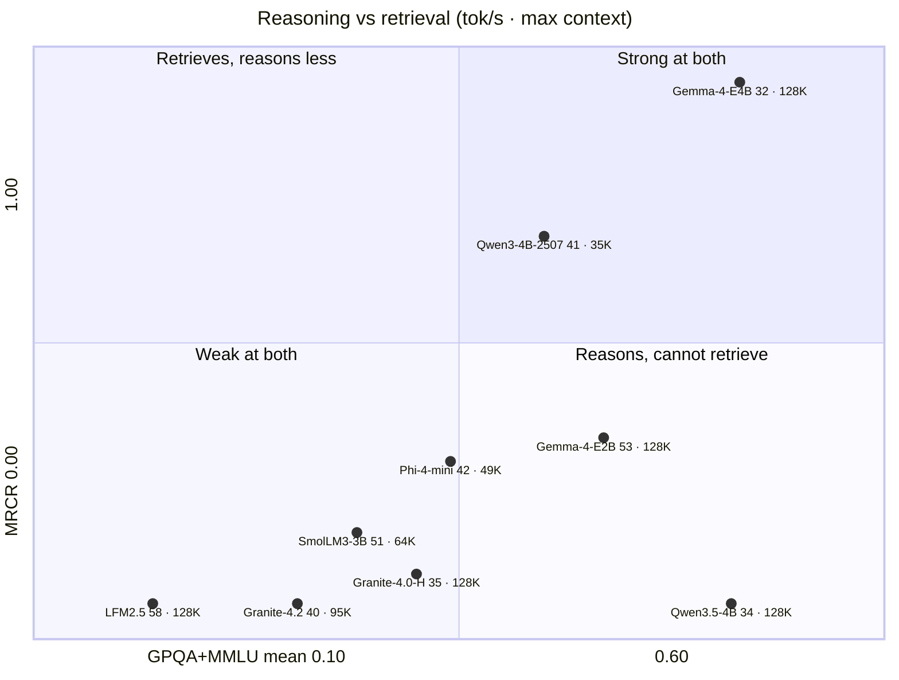
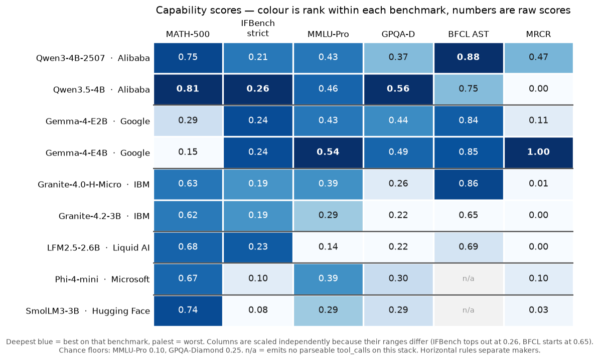
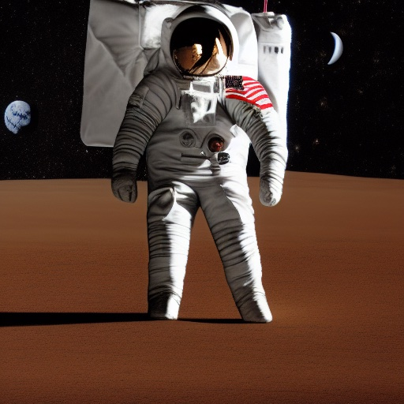
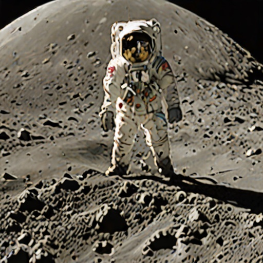

# Models for a 4 GB GPU

Which models fit, how fast they run, how much context they hold, and how capable they are. All measurements come from this machine; see [benchmarking.md](benchmarking.md) for the methods and their caveats.

- [At a glance](#at-a-glance)
- [Who makes these models](#who-makes-these-models)
- [Speed and fit](#speed-and-fit)
- [Context ceilings](#context-ceilings)
- [Capability scores](#capability-scores)
- [Long-context retrieval](#long-context-retrieval)
- [Choosing a model for unattended work](#choosing-a-model-for-unattended-work)
- [Image models](#image-models)

## At a glance

Two views of the same measurements: **where** a model sits on the axes that decide a choice, and **who wins** each benchmark.

### Reasoning against retrieval

**Horizontal** is knowledge and reasoning (mean of GPQA-Diamond and MMLU-Pro, 0.10 to 0.60), **vertical** is long-context retrieval (MRCR at ~19K tokens, 0.00 to 1.00). After each name: **generation speed** in tokens per second, then the **largest context that fits on this 4 GB card** — measured, with a q4_0 KV cache, from the [ceilings table](#context-ceilings). Several of those maxima are the model's trained limit rather than the card's.

**The two models at the right edge are the whole argument.** Gemma-4-E4B and Qwen3.5-4B are separated by 0.005 on reasoning and 2 tok/s — and by the full height of the chart on retrieval, where one reproduces a 19K-token message verbatim and the other scores zero. No capability leaderboard predicts that; it only appears if you measure long context directly.

**Gemma-4-E4B is alone in the top-right**, and pays for it with speed: it is the slowest decoder in the set. **Gemma-4-E2B** is the pragmatic pick below it — 53 tok/s, the smallest footprint here (1.65 GB), and enough retrieval to be useful. **LFM2.5** sits in the bottom-left by design: the fastest model in the set, built for short high-volume work, and the wrong choice for anything that must remember a long conversation.

**Context capacity cuts across the other two axes.** Five models hold their full 128K window on this card, and they sit in every quadrant — the ceiling is set by [KV geometry](#context-ceilings), not by how good the model is. The two that are genuinely constrained are Qwen3-4B-2507 (35K, the heaviest cache in the set at 144 KiB/token) and Phi-4-mini (49K); in both cases a q4_0 cache is what buys even that, since at f16 they manage about 10K and 14K.

*The quadrant boundaries fall at reasoning 0.35 and MRCR 0.25. The retrieval axis is square-root scaled, because five of the nine models score within 0.04 of zero and would otherwise be one unreadable blob.*

### Ranking across every benchmark

*Colour is rank **within each column**, because the benchmarks have very different ranges — IFBench tops out at 0.26 while BFCL starts at 0.65, so one 0–1 scale would leave most of the grid uniformly pale. Read colour as "who is best at this benchmark" and the printed number as the score. Rendered as an image because GitHub strips inline CSS from Markdown, so a genuinely coloured table cell does not survive there; regenerate with [`scripts/score-heatmap.py`](scripts/score-heatmap.py).*

**Scan a row to judge a model, a column to judge a benchmark.** No row is blue throughout: Qwen3.5-4B is deepest on three columns and palest on MRCR, Gemma-4-E4B owns MRCR and MMLU-Pro while sitting bottom on MATH-500. The BFCL column is the flattest — seven of nine between 0.65 and 0.88 — so tool calling barely separates this class, while MRCR is the steepest.

## Who makes these models

Six organizations, all shipping open-weight models small enough for a 4 GB card. The tables further down compare them head to head; this section is who they are and what each model actually is.

Release dates, parameter counts, context windows and licenses below come from the model cards and configuration files on Hugging Face, checked September 2026. Everything else on this page was measured here.

### Alibaba — Qwen

The most prolific open-weight family, Apache-2.0 throughout, and the reference point most small models are compared against. Both entries here are strong but very different generations.

| Model | Released | Parameters | Architecture | Trained context |
|---|---|---|---|---|
| [Qwen3-4B-Instruct-2507](https://huggingface.co/Qwen/Qwen3-4B-Instruct-2507) | Aug 2025 | 4.0B | Dense, 36 layers, [GQA](glossary.md#g-arch) | 256K |
| [Qwen3.5-4B](https://huggingface.co/Qwen/Qwen3.5-4B) | Feb 2026 | 4.7B | [Gated DeltaNet](glossary.md#g-gdn) hybrid, 32 layers, multimodal | 256K (extensible to ~1M) |

**Qwen3-4B-Instruct-2507** is the non-thinking instruct refresh of Qwen3-4B, and the best tool caller measured here (0.88 BFCL). Its weakness on this hardware is memory shape rather than quality: a 144 KiB/token KV cache, the heaviest in the set, so context is what runs out first.

**Qwen3.5-4B** replaces most attention layers with Gated DeltaNet, a linear-attention variant with a fixed-size state. It leads on maths and science here. Two practical notes: it is natively multimodal, though the GGUF build used here is text-only, and its prefill is a sequential scan — cheap on a native driver, expensive through [MoltenVK](glossary.md#g-moltenvk), so long prompts cost more than its generation rate suggests.

### Google — Gemma

Gemma 4 (March 2026) spans E2B, E4B, 12B, 31B and a 26B-A4B mixture-of-experts; only the two "E" models fit here. The card lists Apache-2.0, alongside Google's [Gemma terms](https://ai.google.dev/gemma/docs/gemma_4).

| Model | Released | Parameters | Architecture | Trained context |
|---|---|---|---|---|
| [Gemma-4-E2B-it](https://huggingface.co/google/gemma-4-E2B-it) | Mar 2026 | 5.1B stored / ~2B effective | gemma4 [PLE](glossary.md#g-arch), 35 layers, multimodal | 128K |
| [Gemma-4-E4B-it](https://huggingface.co/google/gemma-4-E4B-it) | Mar 2026 | 8.0B stored / ~4B effective | gemma4 PLE, 42 layers, multimodal | 128K |

The **E** stands for *effective* parameters, and it is the reason these models matter on a small card. Per-layer embeddings keep a large embedding table in host RAM while only the compute core occupies VRAM, so E2B stores 5.1B parameters but occupies **1.45 GB** of the GPU — less than models with half the parameter count. It also prefills faster than anything else here.

Google additionally publishes **quantization-aware trained** q4_0 GGUFs for both, which are trained to tolerate 4-bit weights rather than being quantized after the fact. The E4B QAT build is 4.8 GB and does not fit this card. The E2B one does, and was measured here against the community Q4_K_M build:

| | Q4_K_M | QAT q4_0 |
|---|---|---|
| File size | 2.9 GB | 3.1 GB |
| VRAM resident (4K context) | 1652 MB | **1586 MB** |
| pp512 | **148.8** | 136.8 |
| tg128 | 53.1 | **54.8** |
| MATH-500 | 0.29 ¶ | 0.14 ¶ |
| IFBench strict | 0.24 | 0.22 |
| MMLU-Pro (n=28) | **0.43** | 0.29 |
| GPQA-Diamond | 0.44 | 0.43 |
| BFCL AST | 0.838 | 0.838 |

**Quantization-aware training buys nothing here.** The two builds tie on the largest-sample benches — GPQA (0.44 against 0.43, n=100) and BFCL (identical at n=80) — and IFBench separates them by less than its noise. QAT trades 8% of prefill for 3% of generation and 66 MB of VRAM. The MMLU-Pro gap looks large but rests on 12 correct answers against 8 at n=28, below the resolution of that sample. Both MATH scores are the ¶ formatting artifact, and QAT is worse at it: it produced a parseable `\boxed{}` on 17 of 100 items against 33, while being right on a similar share of what it did format (82% against 88%).

So on this hardware the ordinary Q4_K_M build is the one to use: a smaller download, faster prefill, and no measured quality cost.

### IBM — Granite

Enterprise-targeted, Apache-2.0, and the family that takes tool calling and instruction following most seriously at small sizes. Three generations appear here, which is useful for seeing what changed.

| Model | Released | Parameters | Architecture | Trained context |
|---|---|---|---|---|
| [Granite-4.0-H-Micro](https://huggingface.co/ibm-granite/granite-4.0-h-micro) | Sep 2025 | 3.2B | [Mamba-2](glossary.md#g-ssm) hybrid, 40 layers (only 4 attention) | 128K |
| [Granite-4.1-3B](https://huggingface.co/ibm-granite/granite-4.1-3b) | Apr 2026 | 3.4B | Dense, 40 layers | 128K |
| [Granite-4.2-3B](https://huggingface.co/ibm-granite/granite-4.2-3b) | Aug 2026 | 3.7B | Dense GQA, 40 layers | 128K (512K with extension) |

**Granite-4.0-H-Micro** is the one that matters on this card. Keeping just 4 of 40 layers as attention — the rest hold a fixed-size recurrent state — gives it a KV cache of 8 KiB/token, so its entire trained context fits in VRAM. Combined with the best tool-calling reliability measured here, that makes it the pick for unattended work.

The later dense 4.1 and 4.2 models are newer but not better on this hardware: they give up the hybrid memory advantage, and 4.2 scores at or below the 4.0 hybrid on every capability bench run here. Granite-4.1-3B has only speed and tool-call data — it was never put through the capability suite, so it has no row in that table.

### Liquid AI — LFM

| Model | Released | Parameters | Architecture | Trained context |
|---|---|---|---|---|
| [LFM2.5-2.6B](https://huggingface.co/LiquidAI/LFM2.5-2.6B) | Jul 2026 | 2.7B | [LFM2 short-convolution](glossary.md#g-lfm2) hybrid, 30 layers | 128K |

Liquid AI builds specifically for on-device inference, and it shows: this is the fastest decoder and the smallest resident model in the set, and it fits its whole 128K window without quantizing the cache. Most layers are gated short convolutions rather than attention.

Note the license — **LFM Open License v1.0**, not Apache-2.0. It is the only model here with custom terms, so check them if the use is commercial.

Liquid AI also publishes [Pipette](glossary.md#g-pipette), the on-device benchmark suite whose datasets this page reuses.

### Microsoft — Phi

| Model | Released | Parameters | Architecture | Trained context |
|---|---|---|---|---|
| [Phi-4-mini-instruct](https://huggingface.co/microsoft/Phi-4-mini-instruct) | Feb 2025 | 3.8B | Dense GQA, 32 layers | 128K |

The oldest model in the set, MIT-licensed, and built on the Phi thesis that carefully curated training data beats scale. It holds up on maths and MMLU-Pro, but it is the tightest fit here at 3.04 GB, and on this stack it answers tool prompts in prose rather than emitting `tool_calls` — which rules it out of agent loops until that template gap is fixed.

### Hugging Face — SmolLM

| Model | Released | Parameters | Architecture | Trained context |
|---|---|---|---|---|
| [SmolLM3-3B](https://huggingface.co/HuggingFaceTB/SmolLM3-3B) | Jul 2025 | 3.1B | Dense, 36 layers | 64K (128K with YaRN) |

Hugging Face's own fully-open small model — weights, data recipe and training details all published, which makes it the most reproducible model here. It scores well on maths, but has the shortest context window of the set, the weakest instruction-following scores, and the same missing `tool_calls` problem as Phi-4-mini on this stack.

## Speed and fit

All [Q4_K_M](glossary.md#g-quant), measured with `llama-bench -ngl 99 -fa 1 -p 512 -n 128 -r 3`, one process per model, with the machine allowed to cool between models.

| Model | Maker | [Architecture](glossary.md#g-arch) | [pp512](glossary.md#g-pp512) tok/s | [tg128](glossary.md#g-pp512) tok/s | VRAM |
|---|---|---|---|---|---|
| Qwen3-4B-Instruct-2507 | Alibaba | dense [GQA](glossary.md#g-arch) | 59.4 ± 0.6 | 40.5 ± 0.1 | 2.82 GB, heaviest [KV cache](glossary.md#g-kv) (144 KiB/token) |
| Qwen3.5-4B | Alibaba | [Gated DeltaNet](glossary.md#g-gdn) | 59.5 ± 0.6 | 33.6 ± 0.1 | 3.05 GB |
| Gemma-4-E2B | Google | gemma4 [PLE](glossary.md#g-arch) | **148.8 ± 0.5** | 53.1 ± 0.1 | 1.45 GB weights, 1.65 GB resident at 4K context (the embedding table stays in host RAM) |
| Gemma-4-E4B | Google | gemma4 [PLE](glossary.md#g-arch) | 60.8 ± 8.7 | 32.3 ± 0.1 | 3.21 GB resident at 4K context |
| Granite-4.0-H-Micro | IBM | [Mamba-2](glossary.md#g-ssm) hybrid | 83.6 ± 17.1 | 34.9 ± 11.2 | 1.95 GB |
| Granite-4.1-3B | IBM | dense | 78.9 ± 15.2 | 46.1 ± 0.1 | 2.24 GB, KV-bound |
| Granite-4.2-3B | IBM | dense [GQA](glossary.md#g-arch) | 76.1 ± 12.2 | 40.2 ± 10.4 | 2.48 GB |
| LFM2.5-2.6B | Liquid AI | [LFM2 hybrid](glossary.md#g-lfm2) (short convolution) | 122.3 ± 0.1 | **58.3 ± 0.1** | 1.84 GB — smallest, most room for context |
| Phi-4-mini | Microsoft | dense [GQA](glossary.md#g-arch) | 75.2 ± 13.1 | 42.0 ± 0.1 | 3.04 GB — tightest fit here |
| SmolLM3-3B | Hugging Face | dense | 93.6 ± 14.6 | 51.2 ± 0.1 | 2.28 GB |

Every model here loads and runs correctly on the Vulkan build with no source changes.

**Read these as a floor.** The GPU idles at 10 MHz, so a cold `tg128` partly measures the clock ramping up. Treat gaps under about 20% as noise, especially on the rows with large error bars (the Granite models), and prefer a [sustained serving measurement](benchmarking.md#sustained-serving-throughput) for "what will I actually get".

**LFM2.5-2.6B is the standout:** the fastest decoder in the set, and the smallest resident, which leaves the most room for a KV cache. Its short-convolution state-space operation (`SSM_CONV`) is correct on this MoltenVK stack, which matters because that operation family is what [produced token salad](README.md#ki-subgroup-size) on earlier hybrid models.

## Context ceilings

**Architecture, not parameter count, decides how much context fits.** The maximum below is the largest window that fits before [spilling to the CPU](glossary.md#g-spill), computed from each model's [KV cache](glossary.md#g-kv) geometry against the **4278 MB** usable, and cross-checked against measured [`ioreg`](glossary.md#g-ioreg) residency.

| Model | Maker | [Architecture](glossary.md#g-arch) (attention layers) | KV f16 per token | Max context, f16 KV | Max context, q4_0 KV | Trained for |
|---|---|---|---|---|---|---|
| Qwen3-4B-2507 | Alibaba | dense GQA (36/36) | 144 KiB | ~10K | ~35K | 256K |
| Qwen3.5-4B | Alibaba | [Gated DeltaNet](glossary.md#g-gdn) hybrid (~8/32) | 32 KiB | ~37K | ~128K | 256K |
| Gemma-4-E2B | Google | gemma4 [iSWA](glossary.md#g-arch) (35 layers, 512-token window on most) | 6 KiB | **128K (capped, measured)** | 128K (capped, measured) | 128K |
| Gemma-4-E4B | Google | gemma4 iSWA (42 layers) | 16 KiB | **64K (measured)** † | 128K (capped, measured) | 128K |
| Granite-4.0-H-Micro | IBM | [Mamba-2](glossary.md#g-ssm) hybrid (4/40) | 8 KiB | **~128K (capped)** | ~128K (capped) | 128K |
| Granite-4.2-3B | IBM | dense GQA (40/40) | 80 KiB | ~27K | ~95K | 128K |
| LFM2.5-2.6B | Liquid AI | [short convolution](glossary.md#g-lfm2) hybrid (8/30) | 16 KiB | **~128K (capped)** | ~128K (capped) | 128K |
| Phi-4-mini | Microsoft | dense GQA (32/32) | 128 KiB | ~14K | ~49K | 128K |
| SmolLM3-3B | Hugging Face | dense [GQA](glossary.md#g-arch) (36/36) | 72 KiB | ~32K | ~64K (capped) | 64K |

"Capped" means the model's *trained* context runs out before the VRAM does.

The two Gemma rows are **measured**, not computed: Gemma-4 uses interleaved sliding-window attention (`n_swa = 512`) and several layers hold no KV cache at all, so the per-layer arithmetic behind the other rows does not describe it. The figures come from llama.cpp's own loader accounting (`-v`), at ctx 32K and 128K:

| | GPU weights | KV at 32K | KV at 128K | GPU total at 128K | Host-RAM embeddings |
|---|---|---|---|---|---|
| Gemma-4-E2B | 1408 MiB | 204 MiB | 780 MiB | **2188 MiB — fits** | 1756 MiB |
| Gemma-4-E4B | 2884 MiB | 552 MiB | 2088 MiB | 4972 MiB — over budget | 2208 MiB |

**E2B holds its entire trained window at f16** with room to spare, so quantizing its cache is optional. **E4B fits 64K at f16** (2884 + 1064 = 3948 MiB) but not 128K; use q4_0 above that, where its whole window fits in about 3572 MiB.

**† Two traps live in this measurement**, both worth knowing before you repeat it:

- **A large CPU weight buffer is normal for these models, not a spill.** Both hold a [per-layer embedding table](glossary.md#g-arch) in host RAM by design — 1756 MiB for E2B, 2208 MiB for E4B — and it stays exactly the same size as context grows. That is what makes an "E2B" fit a 4 GB card, and it also means the VRAM column understates these models' total memory footprint. A spill shows up as a CPU buffer that *grows* with context.
- **[`ioreg`](glossary.md#g-ioreg) undercounts reserved cache.** At 128K it reported *less* memory in use than at 32K, because a one-token warm-up never touches most of the allocation, and at the largest sizes the driver commits beyond physical VRAM. Residency is the right tool for "is this model on the GPU"; the loader log is the right tool for "does this context fit".

## Capability scores

Measured over `llama-server`'s OpenAI endpoint at temperature 0, with thinking disabled and any reasoning output excluded from grading. All Q4_K_M, on this GPU.

> **These are relative rankings on this hardware under one protocol. They are not comparable to published leaderboard numbers** — the sample sizes are small, and the quantization, subset and prompt format all differ from published runs. Protocols are in [benchmarking.md](benchmarking.md#capability-benchmarks).

The colour-coded view of this table is in [At a glance](#ranking-across-every-benchmark).

| Model | Maker | [MATH-500](glossary.md#g-math500) | [IFBench](glossary.md#g-ifbench) strict / loose | [MMLU-Pro](glossary.md#g-mmlu) | [GPQA-D](glossary.md#g-gpqa) | [BFCL AST](glossary.md#g-bfcl) |
|---|---|---|---|---|---|---|
| Qwen3-4B-2507 | Alibaba | 0.75 | 0.21 / 0.23 | 0.43 | 0.37 § | **0.88** |
| Qwen3.5-4B | Alibaba | **0.81** | **0.26** / 0.27 | **0.46** | **0.56** | 0.75 |
| Gemma-4-E2B | Google | 0.29 ¶ | 0.24 / 0.29 | 0.43 | 0.44 | 0.84 |
| Gemma-4-E4B | Google | 0.15 ¶ | 0.24 / **0.32** | **0.54** | 0.49 | 0.85 |
| Granite-4.0-H-Micro | IBM | 0.63 | 0.19 / 0.20 | 0.39 | 0.26 | 0.86 |
| Granite-4.2-3B | IBM | 0.62 | 0.19 / 0.24 | 0.29 | 0.22 § | 0.65 |
| LFM2.5-2.6B | Liquid AI | 0.68 | 0.23 / 0.23 | 0.14 † | 0.22 § | 0.69 |
| Phi-4-mini | Microsoft | 0.67 | 0.10 / 0.13 | 0.39 | 0.30 | n/a ‡ |
| SmolLM3-3B | Hugging Face | 0.74 | 0.08 / 0.11 | 0.29 | 0.29 | n/a ‡ |
| *frontier reference* | — | *~0.98* ᵍ | *~0.83* ᵉ | *~0.90* ᵇ | *~0.955* ᶠ | *~0.78* ᵃ |

Sample sizes: n=100 for MATH-500, IFBench and GPQA-Diamond; n=28 (stratified) for MMLU-Pro; n=80 for BFCL AST.

**The Gemma-4 models were the gap in this table, and they place well.** Both had speed numbers from an earlier round but no capability scores, which is why neither appeared in any recommendation until now.

**Gemma-4-E4B takes the top MMLU-Pro score in the set** (0.54, against Qwen3.5-4B's 0.46) and is second on GPQA-Diamond (0.49), with the best IFBench loose score (0.32) and 0.85 on tool calling. It is also the slowest model measured here (32.3 tg128) and the second-largest resident (3.21 GB), so it buys quality with everything else.

**Gemma-4-E2B is the small-model surprise.** At 1.65 GB resident — the smallest here except on paper — it places **second on IFBench** (0.24, behind only Qwen3.5-4B), **second on MMLU-Pro** (0.43, tied with Qwen3-4B-2507), **second on GPQA-Diamond** (0.44), and **third on tool calling** (0.84 BFCL, and 23/24 on the custom set including the negative cases). It also has the fastest prefill in the set at 148.8 pp512.

Its GPQA score is also the most trustworthy in that column: it emitted a graded answer on **100 of 100** items, against 23 and 40 unparsed for the two Qwen models above it. The same holds for E4B (5 unparsed), so both Gemma rows understate the gap to the Qwen models rather than flattering it. Read its MATH-500 score with the ¶ caveat below, not as a maths verdict.

**How to read it.** Every column is accuracy from 0 to 1. MATH-500 is graded by symbolic equivalence. IFBench strict is the fraction of prompts where *every* verifiable instruction was met; loose tolerates markdown and stray boundary lines. MMLU-Pro is 10-option reasoning (chance floor 0.1); GPQA-Diamond is 4-option graduate science (chance floor 0.25); BFCL AST is single-turn tool-call correctness. The frontier reference row gives scale only — those are published full-benchmark scores from each vendor's own harness, not a target this hardware was measured against.

**Three caveats are measurement artifacts, not model verdicts:**

- **† LFM2.5's MMLU-Pro score of 0.14** is depressed by the answer-token budget. With its reasoning preamble, it often doesn't reach the required `The answer is (X)` before the cap, and scores 0 on those items. Read it as *not measured well here*; its MATH and IFBench scores are mid-pack.
- **‡ Phi-4-mini and SmolLM3 show "n/a" for BFCL.** Both answer tool prompts *in prose* and emit no parseable `tool_calls` through llama.cpp's `--jinja` path on this build. That's a chat-template gap on this stack, likely fixable with a `--chat-template` override or a newer build, not an absence of tool-calling ability. Recorded as n/a rather than 0 so it isn't averaged in.
- **¶ Gemma-4-E2B's MATH-500 0.29 measures one formatting convention, not arithmetic.** It emitted a parseable `\boxed{}` on only **33 of 100** items — against 98/100 for Granite-4.0-H-Micro — and was **correct on 29 of those 33 (88%)**. The other 67 score 0 under the convention that an unparseable answer is wrong. This is specific to MATH's LaTeX `\boxed{}` requirement rather than a general formatting weakness: on GPQA-Diamond, which wants `The answer is (X)`, the same model produced a graded answer on **100 of 100** items. It is a family trait — E4B formatted 17 of 100 and the QAT build 17 of 100, each right on 82-88% of what it did format. Whatever the true maths ability of these models is, this column does not measure it.
- **§ GPQA is understated for these rows** by a high unparsed rate: the answer letter had to be recovered from the reasoning channel, and these models often emitted no graded A–D (LFM2.5 57%, Granite-4.2 60%, Qwen3-2507 40% unparsed), scoring 0 there. Their true scores are above the printed value.

**What the numbers say.** Qwen3.5-4B leads on maths, with SmolLM3-3B and Qwen3-4B-2507 close behind. **IFBench is brutal for everything in this class** — the best here is 0.26 against a frontier of about 0.83, making strict instruction-following the clearest gap, and Gemma-4-E2B is second on it at a third of the size. Tool calling splits cleanly into models that emit OpenAI `tool_calls` on this stack (Qwen3-4B-2507, Granite-4.0-H-Micro and Gemma-4-E2B lead) and models that don't yet. On GPQA-Diamond, the models clearly above the 0.25 chance floor are Qwen3.5-4B (0.56), Gemma-4-E4B (0.49), Gemma-4-E2B (0.44) and Qwen3-4B-2507 (0.37). MMLU-Pro's top score belongs to Gemma-4-E4B (0.54). Turning thinking on would raise the maths, MMLU and GPQA columns for the reasoning-capable models, at a large cost in throughput; it was disabled here for a like-for-like comparison.

**Coherence.** Every model scored here clears the [correctness battery](benchmarking.md#text-correctness-battery)'s repetition check (repetition ratio ≈ 0.01), including the hybrids and all three Gemma builds. Gemma-4-E4B passes the battery outright (4/4 plus coherence); the two E2B builds answer correctly but behind a `[Start thinking]` preamble that defeats the exact-match scorer, which is a harness artifact rather than a model failure. Scoring well on any of these benchmarks is itself proof that the output is coherent rather than [NaN](glossary.md#g-nan) garbage — a broken GPU path produces fluent loops, not 0.84 on tool calling.

**Long context: see [the section below](#long-context-retrieval).** Earlier editions of this page reported these benchmarks as "largely timed out". That was a 400-second client limit, not the hardware. Given time, this card does long-context work — and one model does it perfectly.

ᵃ Claude Opus 4.5 (FC), overall BFCL-V4 — [Gorilla leaderboard](https://gorilla.cs.berkeley.edu/leaderboard.html), 2026. Our column is the single-turn AST subset only. ᵇ Qwen3.7 Max, full MMLU-Pro — [llm-stats](https://llm-stats.com/benchmarks/mmlu-pro), 2026. ᵉ Grok 4.3 (medium), IFBench — [Artificial Analysis](https://artificialanalysis.ai/evaluations/ifbench). ᶠ Gemini 3.1 Pro tier, GPQA Diamond — [Artificial Analysis](https://artificialanalysis.ai/evaluations/gpqa-diamond), 2026. ᵍ Frontier tier, MATH-500 — near-saturated at about 0.98; no single canonical leaderboard.

Leaderboards move. Re-check these before quoting them.

## Long-context retrieval

[LongBench-v2](glossary.md#g-longbench) (4-choice questions over ~12–13K-token documents, n=3) and [MRCR](glossary.md#g-mrcr) (reproduce one specific earlier message from a ~19K-token conversation, n=2), served at ctx 32768. **Time to response is reported alongside the score**, because on this card it is the binding constraint rather than an afterthought.

| Model | Maker | [MRCR](glossary.md#g-mrcr) | MRCR s/item | [LongBench](glossary.md#g-longbench) | LB s/item | KV |
|---|---|---|---|---|---|---|
| Qwen3-4B-Instruct-2507 | Alibaba | 0.468 | 1263 | 0.000 | 376 | q4_0 |
| Qwen3.5-4B | Alibaba | 0.000 | 789 | 0.000 | 1032 | f16 |
| Gemma-4-E2B | Google | 0.113 | 287 | 0.000 | 168 | q4_0 |
| **Gemma-4-E4B** | Google | **1.000** | 476 | 0.000 | 293 | q4_0 |
| Granite-4.0-H-Micro | IBM | 0.014 | 231 | 0.000 | 140 | f16 |
| Granite-4.2-3B | IBM | 0.000 | 462 | 0.000 | 299 | q4_0 |
| LFM2.5-2.6B | Liquid AI | 0.000 | 199 | 0.000 | 141 | f16 |
| Phi-4-mini | Microsoft | 0.103 | 536 | **0.333** | 291 | q4_0 |
| SmolLM3-3B | Hugging Face | 0.034 | 447 | 0.000 | 267 | q4_0 |

**Gemma-4-E4B reproduced both target messages verbatim**, prefix and all, from ~19K-token inputs — a perfect 1.000 at about 8 minutes per request. Nothing else comes close, and the model was not even in this page's shortlist until it was finally benchmarked.

**Retrieval quality runs opposite to speed.** LFM2.5 answers a 19K-token MRCR item in 199 s and scores 0.000; Qwen3-4B-2507 takes 1263 s and scores 0.468. On this hardware, long-context ability is bought with latency, so size the timeout to the model rather than assuming a hung request.

**Qwen3.5-4B is the cautionary row.** It leads every short-prompt capability bench on this page and is the worst model here at long context: 0.000 on MRCR without even emitting the required prefix, and 1032 s per LongBench item — 7× Granite-4.0-H-Micro — because its [Gated DeltaNet](glossary.md#g-gdn) prefill is a sequential scan that MoltenVK executes slowly. Short-prompt scores do not predict this.

**LongBench at n=3 discriminates nothing.** Eight of nine models scored 0/3, the ninth 1/3. Treat the column as evidence the runs complete, not as a ranking; MRCR carries the signal at this sample size.

**Every row is a genuine answer**, not a parse failure: all nine models score 0 unparsed under the final protocol. Three of them were re-run after the [harness fixes](benchmarking.md#long-context-benchmarks) landed; the fixes changed LFM2.5 and Gemma-4-E2B from "unparsed" to real wrong answers, and left every score unchanged. Granite-4.0-H-Micro reproduced to the decimal (MRCR 0.014, LongBench 140 s against 142 s), which is a useful reminder that this machine *is* reproducible when one process owns the GPU.

## Choosing a model for unattended work

If the machine is meant to work on its own — an agent loop, a batch job, a scheduled task — the rankings above are the wrong ones. Speed stops mattering once a task finishes in minutes rather than hours, and three other properties start to:

1. **Does it call tools correctly, including declining to?** An unattended loop fails the moment it invents a function name or fabricates an argument. Negative cases matter more than positive ones.
2. **Does the run survive?** A [`vk::DeviceLostError`](glossary.md#g-device-lost) or a timeout ends the job with no output at all, which is much worse than a slow but complete answer.
3. **Does context growth kill it?** Agent loops accumulate history, and architecture decides how fast the cache grows.

**Granite-4.0-H-Micro is the pick**, with real competition. It has the best tool-calling behaviour measured here (24/24 on the custom set including negative cases, and 0.86 BFCL AST, statistically tied with Qwen3-4B-2507's 0.88), and its fixed-size recurrent state means context growth costs almost no VRAM. It's mid-pack on speed.

**LFM2.5-2.6B is the strongest all-rounder** if footprint and throughput matter: the fastest decoder, the smallest resident, cheap context growth, proper `tool_calls`, and coherent on Vulkan. Choose it over Granite for speed and headroom; choose Granite when tool-call reliability is paramount. Qwen3-4B-Instruct-2507 remains the tool-calling leader and a good default for bounded context.

**Gemma-4-E2B is the new contender at the small end**, and the one this page previously under-rated because it had speed numbers but no capability scores. It calls tools well (0.84 BFCL, 23/24 on the custom set), follows instructions better than anything here except Qwen3.5-4B, matches Qwen3-4B-2507 on MMLU-Pro, prefills fastest in the set, and does it in 1.65 GB. **Gemma-4-E4B** is the quality end of the same family: the best MMLU-Pro score measured here (0.54) and second on GPQA (0.49), at the cost of being the slowest model in the set and needing 3.21 GB.

Both share one quirk worth testing before you rely on them: they follow a requested answer format inconsistently. On GPQA's `The answer is (X)` they are near-perfect, on MATH's `\boxed{}` they comply less than a third of the time. If your loop parses a specific output shape, check that shape first. Their [KV cache](#context-ceilings) geometry has not been measured yet, so their context ceilings on this card are not yet known.

**Avoid Phi-4-mini and SmolLM3-3B for tool-driven loops.** They emit no parseable `tool_calls` on this stack, so they will silently never call a function. Nothing in the set needs avoiding on stability grounds: all of them are coherent and survive.

**Configuration for unattended work**, all of it trading throughput you don't need:

- **Serve, don't relaunch.** A resident [LocalAI](localai.md) or `llama-server` process avoids paying model load per task, and keeps the GPU warm — which on this machine makes it *faster*.
- **Cap the context deliberately** and let the client truncate, rather than discovering the ceiling as a device loss mid-job. Size it from the [table above](#context-ceilings), with headroom, and use `-fa on -ctk q4_0 -ctv q4_0` if you need more than f16 allows.
- **Supervise the process.** Device loss can't be recovered in-process, so run under `launchd` or another supervisor with a restart policy, and make the client retry idempotently.
- **Don't stack GPU work back to back.** The one reproducible trigger for device loss here was continuous sweeps with no gap.
- **Log [`ioreg`](glossary.md#g-ioreg) residency** alongside your job output. A silent fall back to the CPU still produces correct answers, just about 3× slower, and you want that in the log rather than as a mystery.

**What this doesn't rest on:** no multi-turn agent benchmark was run, so "calls tools correctly" is measured single-turn only. Multi-turn state tracking, recovery after a failed call and long-horizon planning are exactly where 4B-class models are weakest, and nothing here measures them. Treat the recommendation as "the most reliable thing that fits in 4 GB", not as a claim of reliability in absolute terms.

## Image models

| Model | Load options | VRAM | s/step | Use for |
|---|---|---|---|---|
| SD-Turbo | `--type q8_0` | 2049 MB | ~1.7 | Iterating. A 4-step image takes about 7 s of compute. |
| SD 1.5 | fp16 | 2035 MB | ~3.4 | The [LoRA and ControlNet](glossary.md#g-lora) ecosystem, at 20 steps |
| SDXL-Turbo | `--type q8_0 --vae-on-cpu` | 3836 MB | ~9.3 | Final images. Tight against the 4278 MB usable. |

Measured [CLIP](glossary.md#g-clip) prompt adherence over six prompts is **tied**: SD-Turbo 33.84, SD 1.5 34.08, SDXL-Turbo 34.20 — within noise of each other, though individual prompts differ by up to 10 points. SD-Turbo is also 2× faster per image.

### The same six prompts on all three models

Fixed seed (42), 512×512, one run per model, so these are directly comparable. The number under each image is its [CLIP score](glossary.md#g-clip) — prompt adherence, higher is better; **bold** wins the row.

| Prompt | SD-Turbo · 30–43 s | SD 1.5 · 73–77 s | SDXL-Turbo · 63–69 s |
|---|---|---|---|
| *astronaut riding a horse on the moon, detailed photograph* |  **40.56** |  30.78 |  30.54 |
| *a cozy bookstore cafe interior, warm light, rain on the window, cinematic* |  27.88 |  **32.99** |  32.44 |
| *close-up portrait of an elderly fisherman, weathered face, natural light* |  33.01 |  **39.19** |  37.31 |
| *a red fox sitting in a snowy forest at dawn, sharp focus* |  33.31 |  31.81 |  **35.17** |
| *a bowl of ramen with steam rising, food photography, top-down* |  33.82 |  34.69 |  **35.78** |
| *a futuristic city skyline at sunset, flying cars, concept art* |  34.49 |  **35.04** |  33.96 |
| **mean** | 33.84 | 34.08 | **34.20** |

**Look at the first row before trusting the means.** The prompt asks for an astronaut *riding a horse*; SD-Turbo draws the horse, SDXL-Turbo omits it and renders an astronaut standing on the moon. That single prompt is the largest gap in the set (40.56 against 30.54) and it is the "drops prompt detail at 4 steps and cfg 1" behaviour in action. Averaged over six prompts it disappears entirely.

The per-prompt scores, the CLIP protocol and the command lines are in [stable-diffusion.cpp.md](stable-diffusion.cpp.md#image-quality).

**Vision models** run through [ollama](ollama.md#performance): Qwen3-VL-4B holds about 32 tok/s with `OLLAMA_IMAGE_MIN_TOKENS=512`, against 8–15 tok/s and decaying at the upstream default of 1024.
